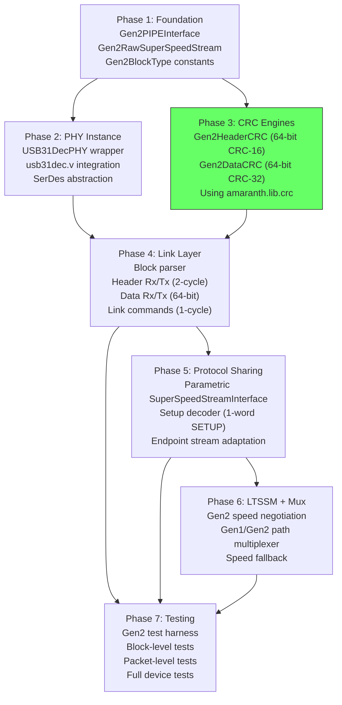

# LUNA USB 3.1 Gen2 — 64-bit Implementation Plan

## Executive Summary

This document describes a practical plan to build a **new USB 3.1 Gen2 (10 Gbps) path** in LUNA using a **64-bit internal data path at ~156.25 MHz**, co-existing alongside the existing Gen1 (5 Gbps) 32-bit path. The Gen2 physical layer is provided by [`usb31dec.v`](../usb31dec.v) instantiated as an Amaranth `Instance`. CRC computation uses **Amaranth's built-in `amaranth.lib.crc` module**, eliminating the need for hand-expanded polynomial equations.

### Key Decisions

| Decision | Choice | Rationale |
|----------|--------|-----------|
| Internal data width | **64-bit** | Matches `usb31dec.v` output directly — no gearbox needed |
| Clock frequency | **~156.25 MHz** | 10 Gbps ÷ 64 bits; achievable on Kintex-7, ECP5, Gowin |
| Gen1 coexistence | **Yes** | Gen1 32-bit path stays untouched; dual-speed via LTSSM |
| CRC implementation | **`amaranth.lib.crc`** | Built-in, parameterized, generates hardware for any width |
| Encoding | **128b/132b** | Handled entirely by `usb31dec.v` — LUNA sees decoded blocks |
| Scrambling | **Handled by PHY** | `usb31dec.v` does Gen2 scrambling/descrambling internally |

---

## 1. Architecture Overview

```mermaid
graph TB
    subgraph "USB 3.1 Dual-Speed Device"
        subgraph "Gen1 Path — Unchanged"
            G1_SERDES["Gen1 SERDES PHY<br/>PIPE 32-bit @ 125 MHz"]
            G1_PHYS["Existing Physical Layer<br/>8b/10b, scrambling, CTC"]
            G1_LINK["Existing Link Layer<br/>32-bit CRC, framing"]
        end
        
        subgraph "Gen2 Path — NEW"
            G2_INST["usb31dec.v Instance<br/>Gen2 PIPE 64-bit @ 156.25 MHz"]
            G2_WRAP["Gen2 PHY Wrapper<br/>Instance + signal mapping"]
            G2_LINK["Gen2 Link Layer<br/>64-bit CRC, block-type framing"]
        end
        
        LTSSM["LTSSM Controller<br/>Speed negotiation"]
        MUX["Speed Mux<br/>Gen1 ↔ Gen2"]
        
        subgraph "Shared Layers"
            PROTO["Protocol Layer<br/>SuperSpeedStreamInterface"]
            APP["Application Layer<br/>Endpoints, Descriptors"]
        end
        
        G1_SERDES --> G1_PHYS --> G1_LINK --> MUX
        G2_INST --> G2_WRAP --> G2_LINK --> MUX
        LTSSM -.->|speed select| MUX
        MUX --> PROTO --> APP
    end
```



### Data Flow (Gen2 Path)

```
usb31dec.v                    Gen2 PHY Wrapper              Gen2 Link Layer
┌──────────────┐             ┌──────────────────┐          ┌──────────────────┐
│ PipeRxData   │──64-bit──→  │ Gen2PIPEInterface │──stream→ │ Block Parser     │
│ PipeRxSync   │──4-bit───→  │ → Gen2RawStream   │          │ → Header Rx      │
│ PipeRxStart  │──1-bit───→  │                    │          │ → Data Rx        │
│ PipeRxValid  │──1-bit───→  │                    │          │ → Link Cmd Rx    │
│              │             │                    │          │ → CRC (amaranth) │
│ PipeTxData   │←─64-bit──  │                    │←─stream─ │ → Header Tx      │
│ PipeTxSync   │←─4-bit───  │                    │          │ → Data Tx        │
│ PipeTxStart  │←─1-bit───  │                    │          │ → Link Cmd Tx    │
│ PipeTxValid  │←─1-bit───  │                    │          │                  │
└──────────────┘             └──────────────────┘          └──────────────────┘
```

---

## 2. Gen2 PIPE Interface

### 2.1 New `Gen2PIPEInterface` Class

The existing [`PIPEInterface`](../gateware/interface/pipe.py) is Gen1 (8b/10b with `datak`). Gen2 uses 128b/132b with sync headers. Create a new interface:

```python
# gateware/interface/gen2_pipe.py

from amaranth import *

class Gen2PIPEInterface:
    """PIPE interface for USB 3.1 Gen2 (128b/132b encoding)."""
    
    def __init__(self):
        # Data path — 64-bit (one half of a 128b/132b block)
        self.tx_data        = Signal(64)    # TX data to PHY
        self.tx_sync_head   = Signal(4)     # TX sync header (0x3=data, 0xC=control)
        self.tx_start_block = Signal()      # TX block start marker
        self.tx_data_valid  = Signal()      # TX data valid
        
        self.rx_data        = Signal(64)    # RX data from PHY
        self.rx_sync_head   = Signal(4)     # RX sync header
        self.rx_start_block = Signal()      # RX block start marker
        self.rx_data_valid  = Signal()      # RX data valid
        
        # Control signals (shared with Gen1 PIPE)
        self.power_down     = Signal(2)     # Power state (P0-P3)
        self.tx_elec_idle   = Signal()      # TX electrical idle
        self.tx_detrx_lpbk  = Signal()      # Detect/loopback
        self.rx_polarity    = Signal()      # RX polarity inversion
        self.rx_termination = Signal()      # RX termination
        self.elas_buf_mode  = Signal()      # Elastic buffer mode
        
        # Status signals
        self.rx_elec_idle   = Signal()      # RX electrical idle
        self.rx_status      = Signal(3)     # RX status
        self.phy_status     = Signal()      # PHY status
        self.power_present  = Signal()      # Power present
        
        # Clock
        self.pclk           = Signal()      # PIPE clock (~156.25 MHz)
```

### 2.2 Gen2 Stream Type

```python
# gateware/usb/usb31_stream.py

from amaranth import *
from luna.gateware.stream import StreamInterface

class Gen2BlockType:
    """128b/132b block type constants (from sync header byte in control blocks)."""
    DATA        = 0x3   # Data block (sync header)
    CONTROL     = 0xC   # Control block (sync header)
    
    # Control block subtypes (first byte of control block payload)
    HP_START    = 0x33  # Header Packet Start
    DP_START    = 0x66  # Data Packet Start  
    END_GOOD    = 0x78  # End Good (packet CRC OK)
    END_BAD     = 0x87  # End Bad (packet aborted)
    LINK_CMD    = 0x4B  # Link Command
    TS1         = 0xB4  # Training Sequence 1
    TS2         = 0xD2  # Training Sequence 2
    TSEQ        = 0x2D  # Training Sequence (equalization)
    SKP         = 0x99  # Skip Ordered Set
    SDS         = 0xE1  # Start of Data Stream
    IDLE        = 0x00  # Logical Idle

class Gen2RawSuperSpeedStream(StreamInterface):
    """Stream carrying decoded Gen2 128b/132b blocks at 64-bit width."""
    
    def __init__(self):
        super().__init__(
            payload_width=64,
            extra_fields=[
                ('sync_head',    4),   # Sync header (0x3=data, 0xC=control)
                ('start_block',  1),   # Block start marker
            ]
        )
```

---

## 3. `usb31dec.v` Amaranth Instance

### 3.1 Instance Wrapper

```python
# gateware/interface/usb31_phy.py

from amaranth import *
from luna.gateware.interface.gen2_pipe import Gen2PIPEInterface

class USB31DecPHY(Elaboratable):
    """Wrapper around usb31dec.v Verilog module as Amaranth Instance."""
    
    def __init__(self):
        self.pipe = Gen2PIPEInterface()
        
        # SERDES interface (platform-specific, directly connected to FPGA SERDES)
        self.serdes = USB31SerDesInterface()
        
        # Clocks and reset
        self.ref_clk   = Signal()
        self.phy_resetn = Signal()
    
    def elaborate(self, platform):
        m = Module()
        
        m.submodules.phy = Instance("usb3_1_phy",
            # Clock and reset
            i_phy_resetn            = self.phy_resetn,
            i_ref_clk               = self.ref_clk,
            
            # PIPE interface (LUNA-facing)
            o_pclk                  = self.pipe.pclk,
            i_PipeTxData            = self.pipe.tx_data,
            i_PipeTxSyncHead        = self.pipe.tx_sync_head,
            i_PipeTxStartBlock      = self.pipe.tx_start_block,
            i_PipeTxDataValid       = self.pipe.tx_data_valid,
            o_PipeRxData            = self.pipe.rx_data,
            o_PipeRxSyncHead        = self.pipe.rx_sync_head,
            o_PipeRxStartBlock      = self.pipe.rx_start_block,
            o_PipeRxDataValid       = self.pipe.rx_data_valid,
            
            # Control signals
            i_TxDetectRx_loopback   = self.pipe.tx_detrx_lpbk,
            i_TxElecIdle            = self.pipe.tx_elec_idle,
            i_RxPolarity            = self.pipe.rx_polarity,
            i_RxTermination         = self.pipe.rx_termination,
            i_PowerDown             = self.pipe.power_down,
            i_ElasticityBufferMode  = self.pipe.elas_buf_mode,
            o_RxElecIdle            = self.pipe.rx_elec_idle,
            o_RxStatus              = self.pipe.rx_status,
            o_PhyStatus             = self.pipe.phy_status,
            o_PowerPresent          = self.pipe.power_present,
            
            # SERDES interface (platform-specific)
            i_serdes_upar_clk_i     = self.serdes.upar_clk,
            i_serdes_upar_resp_i    = self.serdes.upar_resp,
            i_serdes_upar_rddata_i  = self.serdes.upar_rddata,
            i_serdes_upar_rdvld_i   = self.serdes.upar_rdvld,
            i_serdes_upar_ready_i   = self.serdes.upar_ready,
            o_serdes_upar_wren_o    = self.serdes.upar_wren,
            o_serdes_upar_addr_o    = self.serdes.upar_addr,
            o_serdes_upar_wrdata_o  = self.serdes.upar_wrdata,
            o_serdes_upar_rden_o    = self.serdes.upar_rden,
            o_serdes_upar_strb_o    = self.serdes.upar_strb,
            
            # SERDES data path
            i_serdes_pcs_tx_clk_i       = self.serdes.pcs_tx_clk,
            i_serdes_tx_fifo_wrusewd_i  = self.serdes.tx_fifo_wrusewd,
            i_serdes_pcs_rx_clk_i       = self.serdes.pcs_rx_clk,
            i_serdes_pma_rx_lock_i      = self.serdes.pma_rx_lock,
            i_serdes_rxfifo_aempty_i    = self.serdes.rxfifo_aempty,
            i_serdes_rx_fifo_rdusewd_i  = self.serdes.rx_fifo_rdusewd,
            i_serdes_rxdata_i           = self.serdes.rxdata,
            i_serdes_rx_vld_i           = self.serdes.rx_vld,
            i_serdes_rxelecidle_i       = self.serdes.rxelecidle,
            i_serdes_astat_i            = self.serdes.astat,
            o_serdes_fabric_rstn_o      = self.serdes.fabric_rstn,
            o_serdes_fabric_tx_clk_o    = self.serdes.fabric_tx_clk,
            o_serdes_pcs_tx_rst_o       = self.serdes.pcs_tx_rst,
            o_serdes_fabric_tx_vld_o    = self.serdes.fabric_tx_vld,
            o_serdes_txdata_o           = self.serdes.txdata,
            o_serdes_fabric_rx_clk_o    = self.serdes.fabric_rx_clk,
            o_serdes_pcs_rx_rst_o       = self.serdes.pcs_rx_rst,
            o_serdes_rxfifo_rd_en_o     = self.serdes.rxfifo_rd_en,
            
            # PLL status
            i_serdes_q0_qpll0_ok_i  = self.serdes.q0_qpll0_ok,
            i_serdes_q0_qpll1_ok_i  = self.serdes.q0_qpll1_ok,
            i_serdes_q1_qpll0_ok_i  = self.serdes.q1_qpll0_ok,
            i_serdes_q1_qpll1_ok_i  = self.serdes.q1_qpll1_ok,
            i_serdes_cpll_ok_i       = self.serdes.cpll_ok,
        )
        
        # Add the Verilog source file to the platform
        platform.add_file("usb31dec.v", open("usb31dec.v").read())
        
        return m
```

---

## 4. CRC Using `amaranth.lib.crc`

This is the **key simplification**. Instead of hand-expanding CRC polynomial equations for each data width (as the current Gen1 code does in [`link/crc.py`](../gateware/usb/usb3/link/crc.py)), we use Amaranth's built-in CRC module which **automatically generates hardware for any data width**.

### 4.1 USB3 CRC Algorithms

USB3 uses two CRC algorithms:

| CRC | Polynomial | Width | Init | Reflect | XOR Out | Used For |
|-----|-----------|-------|------|---------|---------|----------|
| CRC-16 | 0x8005 | 16 | 0xFFFF | Yes | 0xFFFF | Header packets (link layer) |
| CRC-32 | 0x04C11DB7 | 32 | 0xFFFFFFFF | Yes | 0xFFFFFFFF | Data packet payloads |

### 4.2 Implementation with `amaranth.lib.crc`

```python
# gateware/usb/usb31/link/crc.py

from amaranth import *
from amaranth.lib.crc import Algorithm

# USB3 CRC-16 algorithm (for header packets)
USB3_CRC16 = Algorithm(
    crc_width=16,
    polynomial=0x8005,
    initial_crc=0xFFFF,
    reflect_input=True,
    reflect_output=True,
    xor_output=0xFFFF,
)

# USB3 CRC-32 algorithm (for data packets)
USB3_CRC32 = Algorithm(
    crc_width=32,
    polynomial=0x04C11DB7,
    initial_crc=0xFFFFFFFF,
    reflect_input=True,
    reflect_output=True,
    xor_output=0xFFFFFFFF,
)


class Gen2HeaderCRC(Elaboratable):
    """CRC-16 for Gen2 header packets, processing 64 bits per cycle.
    
    Uses amaranth.lib.crc to automatically generate the 64-bit-wide
    CRC hardware. No hand-expanded equations needed.
    """
    
    def __init__(self):
        self.data    = Signal(64)   # 64-bit data input
        self.start   = Signal()     # Reset CRC to initial value
        self.valid   = Signal()     # Data is valid this cycle
        self.crc     = Signal(16)   # Current CRC output
    
    def elaborate(self, platform):
        m = Module()
        
        # Create a 64-bit-wide CRC-16 processor
        # Amaranth generates all the XOR equations automatically!
        m.submodules.crc = crc = USB3_CRC16(data_width=64).create()
        
        m.d.comb += [
            crc.data    .eq(self.data),
            crc.start   .eq(self.start),
            crc.valid   .eq(self.valid),
            self.crc    .eq(crc.crc),
        ]
        
        return m


class Gen2DataCRC(Elaboratable):
    """CRC-32 for Gen2 data packets, processing 64 bits per cycle.
    
    For partial words (last word of a packet may have <8 valid bytes),
    we use multiple CRC processors at different widths, or a single
    processor with byte-enable masking.
    """
    
    def __init__(self):
        self.data         = Signal(64)   # 64-bit data input
        self.start        = Signal()     # Reset CRC
        self.valid_bytes  = Signal(4)    # Number of valid bytes (1-8)
        self.valid        = Signal()     # Data is valid this cycle
        self.crc          = Signal(32)   # Current CRC output
    
    def elaborate(self, platform):
        m = Module()
        
        # Full-width CRC-32 (64-bit input) for complete words
        m.submodules.crc_full = crc_full = USB3_CRC32(data_width=64).create()
        
        # Partial-width CRC processors for end-of-packet
        # Each processes a different number of trailing bytes
        partial_crcs = {}
        for width_bytes in range(1, 8):  # 1 to 7 bytes
            name = f"crc_{width_bytes}B"
            crc_mod = USB3_CRC32(data_width=width_bytes * 8).create()
            m.submodules[name] = crc_mod
            partial_crcs[width_bytes] = crc_mod
        
        # Select the appropriate CRC based on valid_bytes
        with m.Switch(self.valid_bytes):
            for n_bytes in range(1, 8):
                with m.Case(n_bytes):
                    m.d.comb += [
                        partial_crcs[n_bytes].data  .eq(self.data[:n_bytes*8]),
                        partial_crcs[n_bytes].start .eq(self.start),
                        partial_crcs[n_bytes].valid .eq(self.valid),
                        self.crc                    .eq(partial_crcs[n_bytes].crc),
                    ]
            with m.Default():  # 8 bytes (full word)
                m.d.comb += [
                    crc_full.data  .eq(self.data),
                    crc_full.start .eq(self.start),
                    crc_full.valid .eq(self.valid),
                    self.crc       .eq(crc_full.crc),
                ]
        
        return m
```

### 4.3 Why This Is a Game-Changer

The current Gen1 CRC code in [`link/crc.py`](../gateware/usb/usb3/link/crc.py) has **~400 lines of hand-expanded XOR equations** for 32-bit input. For 64-bit, this would double. With `amaranth.lib.crc`:

| Approach | Lines of Code | Correctness | Any Width |
|----------|:---:|:---:|:---:|
| Hand-expanded (current Gen1) | ~400 | Manual verification | ❌ Must redo for each width |
| **`amaranth.lib.crc`** | **~30** | **Proven library** | **✅ Any width automatically** |

---

## 5. Gen2 Link Layer Modules

### 5.1 Block Parser (RX)

In Gen2, the PHY delivers decoded 128b/132b blocks as 64-bit data + sync header. The block parser identifies block types:

```python
# gateware/usb/usb31/link/block_parser.py

class Gen2BlockParser(Elaboratable):
    """Parses Gen2 128b/132b blocks from the PHY stream.
    
    Each block is 128 bits = two 64-bit words from the PHY.
    The sync header (2 bits, delivered as 4-bit field) indicates:
      - 0x3 (01b): Data block
      - 0xC (10b): Control block
    
    For control blocks, the first byte of the payload is the block type.
    """
    
    def __init__(self):
        # Input from PHY
        self.sink = Gen2RawSuperSpeedStream()
        
        # Outputs — one-hot block type indicators
        self.is_hp_start    = Signal()  # Header Packet Start
        self.is_dp_start    = Signal()  # Data Packet Start
        self.is_end_good    = Signal()  # End Good
        self.is_end_bad     = Signal()  # End Bad
        self.is_link_cmd    = Signal()  # Link Command
        self.is_data_block  = Signal()  # Data block (payload data)
        self.is_skip        = Signal()  # SKP ordered set
        self.is_idle        = Signal()  # Logical idle
        
        # Payload data (for data blocks and control block payloads)
        self.block_data     = Signal(64)
```

### 5.2 Header Packet Receiver

At 64-bit, a USB3 header packet (4×32-bit DWs = 128 bits) arrives in **2 cycles**:

```
Cycle 1: DW0[31:0] | DW1[31:0]  (64 bits)
Cycle 2: DW2[31:0] | DW3[31:0]  (64 bits)
```

This is a simple 2-state FSM (vs. 4 states at 32-bit).

### 5.3 Link Command Handler

At 64-bit, a Gen2 link command fits in a **single control block** (one cycle). The block type byte (0x4B) plus the command word and its replica all fit in 64 bits. This simplifies the Gen1 2-state FSM to a single-cycle combinational check.

### 5.4 Data Packet Handler

Data packets use data blocks (sync_head=0x3). The last block is followed by an END_GOOD or END_BAD control block. The CRC-32 is computed over the data payload and checked against the trailing CRC.

At 64-bit, the byte-valid tracking needs 8 bits (vs. 4 at 32-bit), and `data_bytes_remaining` decrements by 8 instead of 4.

---

## 6. Protocol Layer Sharing

### Option A: Parametric `SuperSpeedStreamInterface` (Recommended)

Make the protocol layer width-agnostic:

```python
class SuperSpeedStreamInterface(StreamInterface):
    def __init__(self, payload_words=4):
        super().__init__(payload_width=8 * payload_words, valid_width=payload_words)
```

- Gen1 instantiates with `payload_words=4` (32-bit)
- Gen2 instantiates with `payload_words=8` (64-bit)
- Protocol layer code uses `len(self.valid)` instead of hardcoded `4`

### Option B: Width Converter at Boundary

Keep protocol layer at 32-bit, add a 64→32 converter:

```python
class Gen2ToGen1StreamConverter(Elaboratable):
    """Converts 64-bit Gen2 stream to 32-bit Gen1 stream.
    
    Outputs two 32-bit words per 64-bit input word.
    Runs at the Gen2 clock (156.25 MHz) with valid toggling.
    """
```

This is simpler but means the protocol layer runs at 156.25 MHz (still achievable).

### Recommendation

**Option A** is cleaner long-term. The protocol layer modules that need changes are:
- [`SuperSpeedStreamInterface`](../gateware/usb/stream.py:329) — add `payload_words` parameter
- [`SuperSpeedEndpointInterface`](../gateware/usb/usb3/protocol/endpoint.py) — pass parameter
- [`SuperSpeedSetupDecoder`](../gateware/usb/usb3/application/request.py) — at 64-bit, SETUP packet (8 bytes) arrives in 1 word
- [`endpoints/stream.py`](../gateware/usb/usb3/endpoints/stream.py) — replace hardcoded `4` with `bytes_per_word`
- [`request/standard.py`](../gateware/usb/usb3/request/standard.py) — update valid-bit table

---

## 7. Implementation Phases



### Phase 1: Foundation Types

**New files to create:**
| File | Contents |
|------|----------|
| `gateware/interface/gen2_pipe.py` | `Gen2PIPEInterface` class |
| `gateware/usb/usb31_stream.py` | `Gen2RawSuperSpeedStream`, `Gen2BlockType` |

**No existing files modified.**

### Phase 2: PHY Instance Wrapper

**New files to create:**
| File | Contents |
|------|----------|
| `gateware/interface/usb31_phy.py` | `USB31DecPHY` (Instance wrapper) |
| `gateware/interface/usb31_serdes.py` | `USB31SerDesInterface` (SERDES signal bundle) |

**Existing files to modify:**
- Platform files may need `add_file()` for `usb31dec.v`

### Phase 3: CRC Engines ✅ Simplified by `amaranth.lib.crc`

**New files to create:**
| File | Contents |
|------|----------|
| `gateware/usb/usb31/link/crc.py` | `Gen2HeaderCRC`, `Gen2DataCRC` using `amaranth.lib.crc` |

**This phase is now trivial** — ~50 lines of code instead of ~400+ hand-expanded equations.

### Phase 4: Gen2 Link Layer

**New files to create:**
| File | Contents |
|------|----------|
| `gateware/usb/usb31/link/__init__.py` | Module init |
| `gateware/usb/usb31/link/block_parser.py` | `Gen2BlockParser` — block type detection |
| `gateware/usb/usb31/link/command.py` | `Gen2LinkCommandDetector`, `Gen2LinkCommandGenerator` |
| `gateware/usb/usb31/link/receiver.py` | `Gen2HeaderPacketReceiver` (2-cycle FSM) |
| `gateware/usb/usb31/link/transmitter.py` | `Gen2PacketTransmitter` |
| `gateware/usb/usb31/link/data.py` | `Gen2DataPacketReceiver`, `Gen2DataPacketTransmitter` |
| `gateware/usb/usb31/link/layer.py` | `Gen2LinkLayer` (top-level integration) |
| `gateware/usb/usb31/link/idle.py` | `Gen2IdleHandler` |

### Phase 5: Protocol Layer Sharing

**Existing files to modify:**
| File | Change |
|------|--------|
| `gateware/usb/stream.py` | Add `payload_words` param to `SuperSpeedStreamInterface` |
| `gateware/usb/usb3/protocol/endpoint.py` | Pass `payload_words` through |
| `gateware/usb/usb3/application/request.py` | Handle 1-word SETUP at 64-bit |
| `gateware/usb/usb3/endpoints/stream.py` | Replace hardcoded `4` with `bytes_per_word` |
| `gateware/usb/usb3/request/standard.py` | Update valid-bit table for 8-bit |

### Phase 6: LTSSM and Speed Multiplexer

**New files to create:**
| File | Contents |
|------|----------|
| `gateware/usb/usb31/link/ltssm.py` | `Gen2LTSSMController` (extends existing LTSSM) |
| `gateware/usb/usb31/speed_mux.py` | `SpeedMultiplexer` (Gen1/Gen2 path selection) |

**Existing files to modify:**
| File | Change |
|------|--------|
| `gateware/usb/usb3/device.py` | Add Gen2 path, speed mux |

### Phase 7: Testing

**New files to create:**
| File | Contents |
|------|----------|
| `tests/test_usb31_crc.py` | CRC-16/CRC-32 at 64-bit width |
| `tests/test_usb31_block_parser.py` | Block type detection |
| `tests/test_usb31_receiver.py` | Header packet reception (2-cycle) |
| `tests/test_usb31_data.py` | Data packet reception with CRC |
| `tests/test_usb31_command.py` | Link command detect/generate |
| `tests/test_usb31_device.py` | Full device integration |

---

## 8. What `usb31dec.v` Handles (LUNA Doesn't Need To)

| Function | Handled by `usb31dec.v` | LUNA Needs? |
|----------|:---:|:---:|
| 128b/132b encoding/decoding | ✅ | ❌ |
| Gen2 scrambling (23-bit LFSR) | ✅ | ❌ |
| Gen2 descrambling | ✅ | ❌ |
| Block alignment | ✅ | ❌ |
| 64↔66 bit gearboxing | ✅ | ❌ |
| LFPS detection | ✅ | ❌ |
| LFPS generation | ✅ | ❌ |
| PIPE power state management | ✅ | ❌ |
| RX detect | ✅ | ❌ |
| DC balance (training) | ✅ | ❌ |
| SERDES register init | ✅ | ❌ |
| **CRC computation** | ❌ | ✅ (amaranth.lib.crc) |
| **LTSSM** | ❌ | ✅ |
| **Link commands** | ❌ | ✅ |
| **Header/data packet framing** | ❌ | ✅ |
| **Protocol layer** | ❌ | ✅ |
| **Application layer** | ❌ | ✅ |

---

## 9. Gen1 Modules Made Redundant (for Gen2 Path Only)

These Gen1 modules are **not used** in the Gen2 path (but remain for Gen1):

| Gen1 Module | Replaced By |
|-------------|-------------|
| `physical/scrambling.py` | `usb31dec.v` internal scrambler |
| `physical/alignment.py` | `usb31dec.v` block alignment |
| `physical/ctc.py` | `usb31dec.v` PIPE interface |
| `physical/coding.py` | Gen2 block type constants |
| `physical/layer.py` | `USB31DecPHY` wrapper |
| `physical/lfps.py` | `usb31dec.v` LFPS handler |
| `physical/power.py` | `usb31dec.v` power management |
| `interface/pipe.py` (Gen1 PIPE) | `gen2_pipe.py` |
| `interface/serdes_phy/*` | `usb31_serdes.py` |

---

## 10. File Structure Summary

```
gateware/
├── interface/
│   ├── gen2_pipe.py          ← NEW: Gen2PIPEInterface
│   ├── usb31_phy.py          ← NEW: usb31dec.v Instance wrapper
│   ├── usb31_serdes.py       ← NEW: SERDES signal abstraction
│   └── pipe.py               ← UNCHANGED (Gen1)
├── usb/
│   ├── usb31_stream.py       ← NEW: Gen2 stream types
│   ├── stream.py             ← MODIFIED: parametric SuperSpeedStreamInterface
│   ├── usb31/                ← NEW DIRECTORY
│   │   ├── __init__.py
│   │   ├── device.py         ← NEW: Gen2 device top-level
│   │   └── link/
│   │       ├── __init__.py
│   │       ├── block_parser.py
│   │       ├── command.py
│   │       ├── crc.py        ← NEW: amaranth.lib.crc based
│   │       ├── data.py
│   │       ├── idle.py
│   │       ├── layer.py
│   │       ├── ltssm.py
│   │       ├── receiver.py
│   │       └── transmitter.py
│   └── usb3/                 ← MOSTLY UNCHANGED (Gen1)
│       ├── device.py         ← MODIFIED: add Gen2 path + speed mux
│       ├── protocol/         ← MODIFIED: parametric width
│       ├── application/      ← MODIFIED: parametric width
│       └── endpoints/        ← MODIFIED: parametric width
tests/
├── test_usb31_crc.py         ← NEW
├── test_usb31_block_parser.py ← NEW
├── test_usb31_receiver.py    ← NEW
├── test_usb31_data.py        ← NEW
├── test_usb31_command.py     ← NEW
└── test_usb31_device.py      ← NEW
```

---

## 11. Critical Path

```mermaid
gantt
    title Gen2 64-bit Implementation Critical Path
    dateFormat X
    axisFormat %s
    
    section Foundation
    Gen2PIPEInterface + Stream Types    :p1, 0, 1
    
    section PHY
    usb31dec.v Instance Wrapper         :p2, after p1, 1
    
    section CRC
    amaranth.lib.crc Integration        :p3, after p1, 1
    
    section Link Layer
    Block Parser                        :p4a, after p2, 1
    Header Rx/Tx                        :p4b, after p3, 2
    Data Rx/Tx                          :p4c, after p3, 2
    Link Commands                       :p4d, after p4a, 1
    Link Layer Integration              :p4e, after p4b, 1
    
    section Protocol
    Parametric Width                    :p5, after p4e, 2
    
    section Integration
    LTSSM + Speed Mux                  :p6, after p5, 2
    Testing                            :p7, after p4a, 6
```



The **CRC is no longer the bottleneck** thanks to `amaranth.lib.crc`. The critical path is now the **link layer modules** (block parser, header/data handling, transmitter), which are straightforward engineering work.
