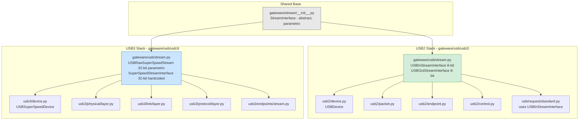
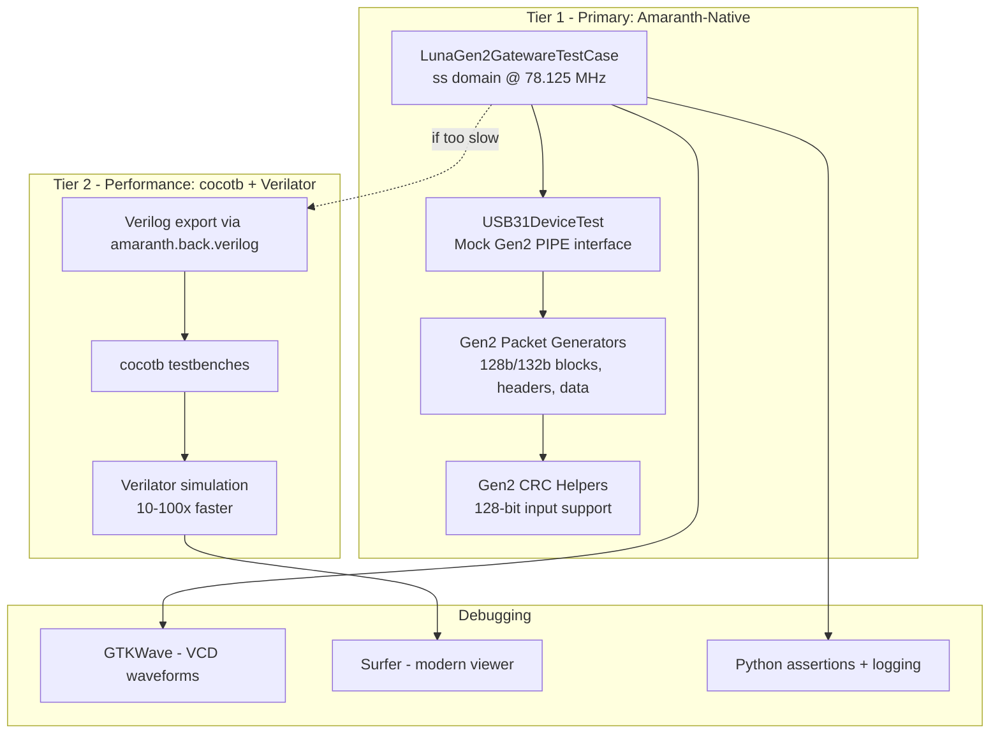
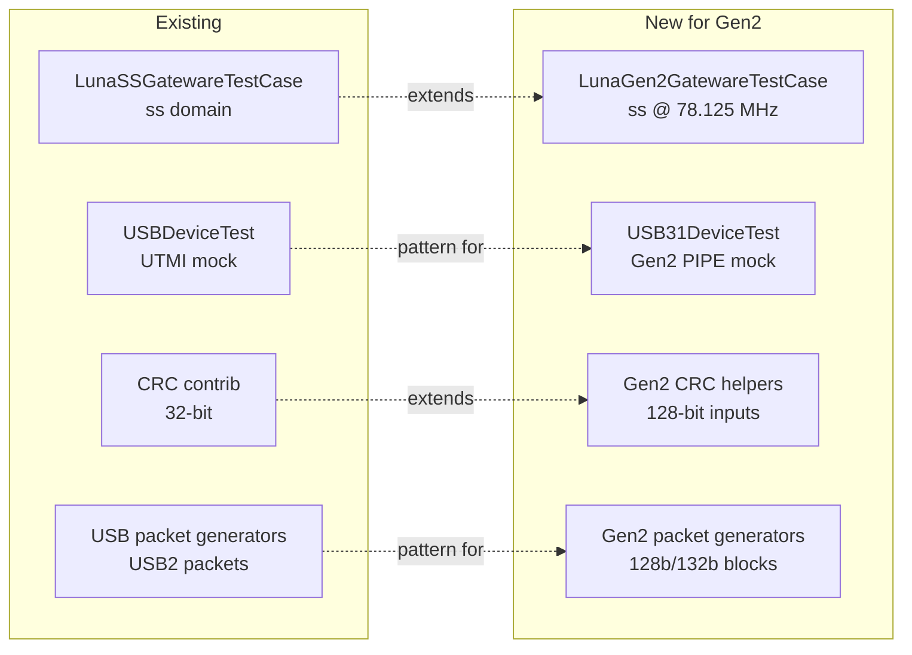
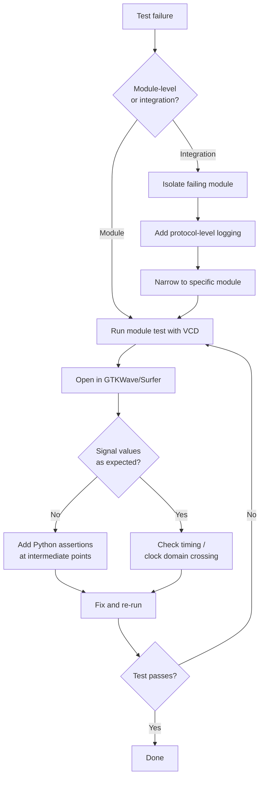

# Testing & Simulation Strategy for 128-bit Gen2 LUNA Stack

> **Document scope:** (1) USB2 path impact analysis for the Gen2 width changes, and (2) simulation/debugging strategy for the 128-bit SuperSpeed Gen2 datapath.

---

## Table of Contents

1. [USB2 Impact Summary](#1-usb2-impact-summary)
2. [Architecture Isolation Proof](#2-architecture-isolation-proof)
3. [Parametric Width Design](#3-parametric-width-design)
4. [Simulation Strategy Overview](#4-simulation-strategy-overview)
5. [VHCI Feasibility Analysis](#5-vhci-feasibility-analysis)
6. [Recommended: Amaranth-Native Testing](#6-recommended-amaranth-native-testing)
7. [Gen2 Test Harness Design](#7-gen2-test-harness-design)
8. [Gen2 Packet Generator Library](#8-gen2-packet-generator-library)
9. [Module-Level Test Plan](#9-module-level-test-plan)
10. [Integration Test Plan](#10-integration-test-plan)
11. [cocotb + Verilator Option](#11-cocotb--verilator-option)
12. [Debugging Workflow](#12-debugging-workflow)

---

## 1. USB2 Impact Summary

**The USB2 stack is completely unaffected by Gen2 width changes.**

The USB2 and USB3 stacks in LUNA are fully isolated — they share no stream types, no PHY interfaces, and no clock domains. Making `payload_words` parametric in the SuperSpeed stack requires **zero changes** to any USB2 module.

| Aspect | USB2 Stack | USB3 Stack | Shared? |
|--------|-----------|-----------|---------|
| Stream types | `USBInStreamInterface` (8-bit), `USBOutStreamInterface` (8-bit) | `USBRawSuperSpeedStream` (32-bit, parametric), `SuperSpeedStreamInterface` (32-bit hardcoded) | No |
| PHY interface | UTMI / ULPI | PIPE | No |
| Clock domain | `usb` | `ss` | No |
| Source directory | `gateware/usb/usb2/` | `gateware/usb/usb3/` | No |
| Base class | `StreamInterface` | `StreamInterface` | Yes (already parametric) |

**Risk to USB2: NONE.**

---

## 2. Architecture Isolation Proof

The following diagram shows the complete separation between USB2 and USB3 import chains. No cross-imports exist between the two stacks.



### Import Chain Verification

- **No file under `gateware/usb/usb2/`** imports any SuperSpeed type (`USBRawSuperSpeedStream`, `SuperSpeedStreamInterface`, or any `usb3` module).
- **No file under `gateware/usb/usb3/`** imports any USB2 stream type (`USBInStreamInterface`, `USBOutStreamInterface`).
- The shared `gateware/usb/request/` modules use `USBInStreamInterface` (a USB2 type) — they are **not affected** by SuperSpeed changes.
- Both stacks inherit from `StreamInterface` in `gateware/stream/__init__.py`, which is already fully parametric.

### File-Level Risk in `gateware/usb/stream.py`

Both USB2 and USB3 stream types are defined in the same file (`gateware/usb/stream.py`), but they are **independent classes**:

| Class | Width | Used By | Risk |
|-------|-------|---------|------|
| `USBInStreamInterface` | 8-bit fixed | USB2 only | None — do not modify |
| `USBOutStreamInterface` | 8-bit fixed | USB2 only | None — do not modify |
| `USBRawSuperSpeedStream` | 32-bit, parametric via `payload_words` | USB3 only | Already parametric |
| `SuperSpeedStreamInterface` | 32-bit hardcoded | USB3 only | **Needs `payload_words` parameter** |

**Risk to shared file: MINIMAL** — only `SuperSpeedStreamInterface` needs modification; USB2 classes are untouched.

---

## 3. Parametric Width Design

The data width is made parametric at instantiation time via the `payload_words` parameter:

```python
# USB 3.0 Gen1 (5 Gbps) — current default
device_gen1 = USBSuperSpeedDevice(phy=phy, payload_words=4)   # 32-bit @ 125 MHz

# USB 3.1 Gen2 (10 Gbps) — new capability
device_gen2 = USBSuperSpeedDevice(phy=phy, payload_words=16)  # 128-bit @ 78.125 MHz
```

### Changes Required

1. **`SuperSpeedStreamInterface`** — Accept `payload_words` parameter (currently hardcoded to 32-bit / 4 words)
2. **Thread `payload_words` through the hierarchy:**


3. **All internal modules** derive width from stream signals dynamically:
   ```python
   # Instead of hardcoded constants:
   width = len(sink.ctrl)  # Derives from stream, works for any payload_words
   ```

4. **Zero changes to USB2 stack** — confirmed by architecture isolation analysis above.

---

## 4. Simulation Strategy Overview

### Why Not VHCI?

Linux VHCI operates at the **USB transfer level (URBs)**, while LUNA operates at the **physical/link layer level (PIPE signals, 128b/132b blocks)**. The abstraction gap is too large to bridge practically. See [Section 5](#5-vhci-feasibility-analysis) for detailed analysis.

### What Works: Amaranth-Native Simulation

LUNA already has a proven test framework built on `amaranth.sim.Simulator`. The Gen2 testing strategy extends this existing infrastructure with:

- A new test base class for Gen2 clock domains
- A mock Gen2 PIPE interface
- Gen2 packet generators (128b/132b blocks)
- Module-level and integration-level tests



---

## 5. VHCI Feasibility Analysis

### The Abstraction Mismatch

Linux VHCI (Virtual Host Controller Interface) at `/sys/devices/platform/vhci_hcd.0/` provides a kernel-level interface for injecting USB Request Blocks (URBs). LUNA, however, operates at the PIPE physical interface level. The gap between these two abstraction layers spans 5+ protocol layers:

```
VHCI URB level
    â USB Core Protocol layer
        â xHCI Transaction layer
            â USB3 Protocol layer
                â Link layer
                    â Physical layer - PIPE signals
```

### Why Bridging Is Impractical

| Challenge | Detail |
|-----------|--------|
| **Protocol stack implementation** | Bridging VHCI to PIPE requires implementing a complete USB3 host controller in software — the xHCI spec alone is 600+ pages |
| **Real-time constraints** | USB3 Gen2 requires responses within microseconds; Verilator runs 15–80× slower than real hardware, making real-time interaction impossible |
| **Timing fidelity** | VHCI has no concept of PIPE-level timing (symbol boundaries, SKP ordered sets, link training sequences) |
| **Development effort** | Multi-person-year effort with no existing open-source implementation to build on |
| **Maintenance burden** | Would need to track changes in both Linux USB stack and LUNA internals |

### Verdict

**Do not pursue VHCI integration.** The effort-to-value ratio is extremely unfavorable. Amaranth-native simulation provides direct access to the exact abstraction level LUNA operates at, with full signal visibility and deterministic behavior.

---

## 6. Recommended: Amaranth-Native Testing

### Existing Test Infrastructure

LUNA already has a comprehensive test framework in `gateware/test/`:

| Component | Location | Purpose |
|-----------|----------|---------|
| `LunaGatewareTestCase` | [`gateware/test/utils.py`](gateware/test/utils.py) | Base test class using `amaranth.sim.Simulator` |
| `LunaSSGatewareTestCase` | [`gateware/test/utils.py`](gateware/test/utils.py) | SuperSpeed variant with `ss` domain |
| `USBDeviceTest` | [`gateware/test/usb2.py`](gateware/test/usb2.py) | Full USB2 device test harness at UTMI level |
| CRC algorithms | [`gateware/test/contrib/crc.py`](gateware/test/contrib/crc.py) | Software CRC implementations for verification |
| USB2 packet generators | [`gateware/test/contrib/usb_packet.py`](gateware/test/contrib/usb_packet.py) | Python functions to create USB2 packets |
| VCD + GTKWave | Built into test framework | Waveform output for debugging |

### Gen2 Extensions Needed

The Gen2 testing strategy mirrors the proven USB2 approach, extending it for 128-bit datapaths:



---

## 7. Gen2 Test Harness Design

### `LunaGen2GatewareTestCase`

New base class for Gen2 module tests:

```python
class LunaGen2GatewareTestCase(LunaSSGatewareTestCase):
    """Base test case for USB 3.1 Gen2 modules.

    Configures the 'ss' clock domain at 78.125 MHz (128-bit @ Gen2 rate).
    Provides helper methods for Gen2-specific signal manipulation.
    """

    SS_CLOCK_FREQUENCY = 78.125e6  # Override from Gen1's 125 MHz

    def initialize_signals(self):
        """Set up default signal states for Gen2 PIPE interface."""
        # 128-bit data bus (16 bytes)
        yield self.dut.sink.data.eq(0)
        yield self.dut.sink.ctrl.eq(0)
        yield self.dut.sink.valid.eq(0)

    def provide_data(self, data_words, ctrl_words=None):
        """Drive a sequence of 128-bit data words onto the sink.

        Args:
            data_words: List of 128-bit integers
            ctrl_words: Optional list of 16-bit ctrl values (default: all 0)
        """
        if ctrl_words is None:
            ctrl_words = [0] * len(data_words)

        for data, ctrl in zip(data_words, ctrl_words):
            yield self.dut.sink.data.eq(data)
            yield self.dut.sink.ctrl.eq(ctrl)
            yield self.dut.sink.valid.eq(1)
            yield
        yield self.dut.sink.valid.eq(0)
        yield
```

### `USB31DeviceTest`

Full device-level test harness with mock Gen2 PIPE interface:

```python
class USB31DeviceTest(LunaGen2GatewareTestCase):
    """Integration test harness for USB 3.1 Gen2 device.

    Provides a mock Gen2 PIPE interface that can:
    - Send/receive 128b/132b framed data
    - Inject ordered sets (SKP, TS1, TS2, LFPS)
    - Simulate link training sequences
    - Generate and verify header/data packets
    """

    FRAGMENT_UNDER_TEST = USBSuperSpeedDevice
    FRAGMENT_ARGUMENTS = dict(payload_words=16)  # 128-bit Gen2

    def instantiate_dut(self):
        """Create DUT with mock Gen2 PIPE PHY."""
        self.phy = MockGen2PIPEInterface()
        return self.FRAGMENT_UNDER_TEST(phy=self.phy, **self.FRAGMENT_ARGUMENTS)

    def send_header_packet(self, header_type, **fields):
        """Send a header packet through the mock PIPE interface.

        Args:
            header_type: USB3 header packet type code
            **fields: Header-specific field values
        """
        packet = gen2_header_packet(header_type, **fields)
        yield from self.provide_data(packet.to_128bit_words())

    def expect_header_packet(self, header_type, **expected_fields):
        """Assert that the DUT transmits a specific header packet."""
        # Capture output from DUT's source interface
        data = yield from self.capture_output(timeout_cycles=100)
        packet = Gen2HeaderPacket.from_128bit_words(data)
        assert packet.type == header_type
        for field, value in expected_fields.items():
            assert getattr(packet, field) == value, \
                f"Header field {field}: expected {value}, got {getattr(packet, field)}"

    def perform_link_training(self):
        """Simulate a complete Gen2 link training sequence."""
        # Send TS1 ordered sets
        yield from self.send_ordered_sets('TS1', count=16)
        # Wait for TS2 response
        yield from self.expect_ordered_sets('TS2', min_count=8)
        # Complete training
        yield from self.send_ordered_sets('TS2', count=16)
        # Wait for idle
        yield from self.wait_for_idle(timeout_cycles=1000)
```

### `MockGen2PIPEInterface`

```python
class MockGen2PIPEInterface:
    """Mock PIPE interface for Gen2 simulation.

    Provides 64-bit data interface (PIPE spec for Gen2) with:
    - TxData[63:0], TxDataK[7:0]
    - RxData[63:0], RxDataK[7:0]
    - Sync header signals for 128b/132b encoding
    - PIPE control signals (PowerDown, TxDetectRx, etc.)
    """

    def __init__(self):
        self.tx_data   = Signal(64)
        self.tx_data_k = Signal(8)
        self.rx_data   = Signal(64)
        self.rx_data_k = Signal(8)

        # 128b/132b sync header
        self.tx_sync_header = Signal(4)
        self.rx_sync_header = Signal(4)

        # PIPE control
        self.power_down    = Signal(2)
        self.tx_detect_rx  = Signal()
        self.phy_status    = Signal(2)
        self.rx_status     = Signal(3)
```

---

## 8. Gen2 Packet Generator Library

Python functions for creating all Gen2 packet types, mirroring the existing USB2 packet generators in [`gateware/test/contrib/usb_packet.py`](gateware/test/contrib/usb_packet.py).

### 128b/132b Block Generators

```python
def gen2_data_block(payload: bytes, scramble: bool = True) -> Gen2Block:
    """Create a 128b/132b data block.

    Args:
        payload: 16 bytes of data payload
        scramble: Whether to apply Gen2 scrambling (default: True)

    Returns:
        Gen2Block with sync_header=0b01 (data) and 128-bit payload
    """
    assert len(payload) == 16
    block = Gen2Block(sync_header=0b01, payload=int.from_bytes(payload, 'little'))
    if scramble:
        block = apply_gen2_scrambling(block)
    return block


def gen2_ordered_set_block(os_type: str) -> Gen2Block:
    """Create a 128b/132b ordered set block.

    Args:
        os_type: One of 'SKP', 'TS1', 'TS2', 'LFPS', 'SDS', 'EIEOS'

    Returns:
        Gen2Block with sync_header=0b10 (ordered set) and appropriate payload
    """
    payloads = {
        'SKP':  SKP_ORDERED_SET_PAYLOAD,
        'TS1':  TS1_ORDERED_SET_PAYLOAD,
        'TS2':  TS2_ORDERED_SET_PAYLOAD,
        'SDS':  SDS_ORDERED_SET_PAYLOAD,
        'EIEOS': EIEOS_PAYLOAD,
    }
    return Gen2Block(sync_header=0b10, payload=payloads[os_type])
```

### Header Packet Generators

```python
def gen2_header_packet(packet_type: int, **fields) -> Gen2HeaderPacket:
    """Create a USB3 header packet formatted for Gen2 transport.

    Args:
        packet_type: USB3 header packet type (e.g., ACK_TP, SETUP, DATA_HEADER)
        **fields: Packet-type-specific fields

    Returns:
        Gen2HeaderPacket containing the framed header with CRC-16 and link framing
    """
    ...


def gen2_data_packet(header_type: int, data: bytes, **header_fields) -> list:
    """Create a complete data packet (header + data payload blocks + CRC-32).

    Args:
        header_type: Header packet type for the data header
        data: Arbitrary-length data payload
        **header_fields: Header-specific fields

    Returns:
        List of Gen2Block objects comprising the complete packet
    """
    ...


def gen2_link_command(command_type: str, **fields) -> Gen2Block:
    """Create a link-layer command (LGOOD, LBAD, LCRD, etc.).

    Args:
        command_type: Link command name
        **fields: Command-specific fields

    Returns:
        Gen2Block containing the link command
    """
    ...
```

### CRC Helpers

Extend the existing CRC module at [`gateware/test/contrib/crc.py`](gateware/test/contrib/crc.py) for 128-bit inputs:

```python
def crc16_gen2(data: int, width: int = 128) -> int:
    """Compute CRC-16 for Gen2 header packets.

    Args:
        data: Input data as integer (up to 128 bits)
        width: Data width in bits (default: 128)

    Returns:
        16-bit CRC value
    """
    ...


def crc32_gen2(data_blocks: list) -> int:
    """Compute CRC-32 for Gen2 data packet payloads.

    Processes a sequence of 128-bit data blocks and returns
    the running CRC-32 value.

    Args:
        data_blocks: List of 128-bit integer values

    Returns:
        32-bit CRC value
    """
    ...
```

---

## 9. Module-Level Test Plan

Each Gen2 module is tested individually with focused unit tests:

| Module | Test File | Key Test Cases |
|--------|-----------|---------------|
| **128-bit CRC-5/16/32** | `test_gen2_crc.py` | Known-answer vectors; compare HW vs SW CRC; multi-cycle accumulation; all-zeros / all-ones edge cases |
| **Gearbox (32→128, 128→32)** | `test_gen2_gearbox.py` | Correct word assembly/disassembly; backpressure handling; partial-word flush; reset behavior |
| **128b/132b framing** | `test_gen2_framing.py` | Sync header detection; data vs ordered-set discrimination; block alignment recovery; error injection |
| **Gen2 scrambler/descrambler** | `test_gen2_scrambling.py` | Known-answer vectors from USB3.1 spec; LFSR state continuity across blocks; reset/resync |
| **Link commands (128-bit)** | `test_gen2_link_cmd.py` | LGOOD/LBAD/LCRD generation and parsing; repeat detection; CRC verification |
| **Header packet TX/RX** | `test_gen2_header.py` | All header types; CRC-16 verification; field extraction; malformed packet rejection |
| **Data packet TX/RX** | `test_gen2_data.py` | Variable-length payloads; CRC-32 verification; sequence numbering; retry logic |
| **SKP ordered set handling** | `test_gen2_skp.py` | SKP insertion at correct intervals; SKP removal; elastic buffer behavior |
| **LTSSM Gen2 extensions** | `test_gen2_ltssm.py` | Gen2 speed negotiation; Recovery.Speed; Loopback at Gen2 rate |
| **Elastic buffer** | `test_gen2_elastic.py` | Clock tolerance absorption; overflow/underflow detection; SKP add/remove |

### Test Pattern for Each Module

```python
class TestGen2CRC(LunaGen2GatewareTestCase):
    FRAGMENT_UNDER_TEST = Gen2CRCComputer

    def test_known_answer_vector(self):
        """Verify CRC against USB 3.1 spec Appendix B test vectors."""
        def process():
            # Drive known input
            yield self.dut.sink.data.eq(SPEC_TEST_VECTOR_INPUT)
            yield self.dut.sink.valid.eq(1)
            yield  # one clock cycle

            # Check output
            crc_out = yield self.dut.crc_out
            self.assertEqual(crc_out, SPEC_TEST_VECTOR_EXPECTED_CRC)

        self.simulate(process)

    def test_matches_software_reference(self):
        """Verify HW CRC matches software CRC for random data."""
        import random
        for _ in range(100):
            test_data = random.getrandbits(128)
            expected = crc32_gen2([test_data])

            def process(data=test_data, exp=expected):
                yield self.dut.sink.data.eq(data)
                yield self.dut.sink.valid.eq(1)
                yield
                crc_out = yield self.dut.crc_out
                self.assertEqual(crc_out, exp)

            self.simulate(process)
```

---

## 10. Integration Test Plan

Full device-level tests exercising complete USB3 Gen2 transactions:

### Test Scenarios

| Scenario | Description | Validates |
|----------|-------------|-----------|
| **Link training** | Complete LTSSM sequence from Rx.Detect through U0 at Gen2 speed | LTSSM, ordered sets, speed negotiation |
| **Control transfer** | GET_DESCRIPTOR via default control endpoint | Protocol layer, endpoint 0, request handling |
| **Bulk OUT** | Host sends bulk data to device endpoint | Data packet RX, CRC-32, flow control (NRDY/ERDY) |
| **Bulk IN** | Device sends bulk data to host | Data packet TX, sequence numbering, ACK handling |
| **Isochronous IN** | Device streams isochronous data | Timestamp packets, continuous streaming |
| **Link error recovery** | Inject CRC errors, verify retry | LGOOD/LBAD, header packet retry, link recovery |
| **Power management** | U0 → U1 → U2 → U0 transitions | LGO_Ux link commands, exit latency |
| **Back-to-back packets** | Maximum throughput burst | Pipeline stalls, buffer management |
| **Mixed traffic** | Interleaved control + bulk + isochronous | Endpoint multiplexing, priority handling |

### Integration Test Example

```python
class TestGen2BulkTransfer(USB31DeviceTest):
    """Test a complete bulk OUT transfer at Gen2 speed."""

    def test_bulk_out_single_packet(self):
        def process():
            # 1. Complete link training
            yield from self.perform_link_training()

            # 2. Send SET_ADDRESS to configure device
            yield from self.send_header_packet(SETUP_TP, address=0, endpoint=0)
            yield from self.send_data_packet(
                DATA_HEADER, data=set_address_request(address=1))
            yield from self.expect_header_packet(ACK_TP)

            # 3. Send bulk data to endpoint 1
            test_data = bytes(range(256))  # 256 bytes of test data
            yield from self.send_header_packet(
                DATA_HEADER, address=1, endpoint=1, length=256)
            yield from self.send_data_blocks(test_data)

            # 4. Verify ACK
            yield from self.expect_header_packet(ACK_TP, endpoint=1)

            # 5. Verify data arrived at endpoint
            received = yield from self.read_endpoint_buffer(endpoint=1)
            self.assertEqual(received, test_data)

        self.simulate(process, vcd_file='test_gen2_bulk_out.vcd')
```

---

## 11. cocotb + Verilator Option

### When to Use

Pursue cocotb + Verilator **only if** Amaranth-native simulation proves too slow for integration tests. Typical thresholds:

| Test Type | Amaranth Sim | Verilator | Speedup |
|-----------|-------------|-----------|---------|
| Module unit test (100 cycles) | ~1 ms | ~0.1 ms | 10× |
| Integration test (10K cycles) | ~1 s | ~10 ms | 100× |
| Full transaction (100K cycles) | ~30 s | ~300 ms | 100× |
| Link training (1M cycles) | ~5 min | ~3 s | 100× |

### How to Set Up

1. **Export Verilog** from Amaranth:
   ```python
   from amaranth.back.verilog import convert
   
   dut = USBSuperSpeedDevice(phy=phy, payload_words=16)
   verilog_source = convert(dut, platform=None)
   
   with open("gen2_device.v", "w") as f:
       f.write(verilog_source)
   ```

2. **Write cocotb testbench**:
   ```python
   import cocotb
   from cocotb.clock import Clock
   from cocotb.triggers import RisingEdge, Timer
   
   @cocotb.test()
   async def test_gen2_bulk_transfer(dut):
       """Test bulk transfer at Gen2 speed using Verilator."""
       clock = Clock(dut.ss_clk, 12.8, units="ns")  # 78.125 MHz
       cocotb.start_soon(clock.start())
       
       # Reset
       dut.ss_rst.value = 1
       await Timer(100, units="ns")
       dut.ss_rst.value = 0
       
       # Drive PIPE interface
       await RisingEdge(dut.ss_clk)
       dut.pipe_rx_data.value = 0xDEADBEEF_CAFEBABE_12345678_9ABCDEF0
       ...
   ```

3. **Run with Verilator**:
   ```bash
   # Makefile.cocotb
   SIM = verilator
   VERILOG_SOURCES = gen2_device.v
   TOPLEVEL = gen2_device
   MODULE = test_gen2_bulk
   
   include $(shell cocotb-config --makefiles)/Makefile.sim
   ```

### Optional: Include `usb31dec.v`

The existing [`usb31dec.v`](usb31dec.v) decoder can be included in Verilator simulations with SERDES stubs for full-stack protocol decoding:

```verilog
// Instantiate alongside DUT for protocol-level visibility
usb31dec #(
    .SERDES_WIDTH(16)  // 128-bit / 8 = 16 symbols
) decoder (
    .clk(ss_clk),
    .data(pipe_tx_data),
    .datak(pipe_tx_datak),
    ...
);
```

---

## 12. Debugging Workflow

### Primary: VCD + GTKWave

LUNA's test framework already generates VCD waveform files. For Gen2 debugging:

```python
# Generate VCD during test
self.simulate(process, vcd_file='debug_gen2_link.vcd')
```

GTKWave configuration (`.gtkw` files) should be created for common debugging scenarios:

| Save File | Signals Shown |
|-----------|--------------|
| `gen2_pipe.gtkw` | PIPE interface: tx_data, rx_data, sync_header, phy_status |
| `gen2_link.gtkw` | Link layer: link_state, tx_header, rx_header, credit_count |
| `gen2_protocol.gtkw` | Protocol: endpoint_select, sequence_number, flow_control |
| `gen2_framing.gtkw` | 128b/132b: sync_header, block_data, scrambler_state |

### Alternative: Surfer

[Surfer](https://surfer-project.org/) is a modern waveform viewer that supports VCD, FST, and GHW formats. It provides:
- Faster rendering for large waveforms
- Better search and filtering
- Protocol-aware signal decoding (extensible)

### Python-Level Debugging

```python
# Add assertions in testbench processes
def process():
    yield from self.provide_data(test_blocks)
    yield  # wait one cycle

    # Check intermediate signals
    link_state = yield self.dut.link_layer.state
    self.assertEqual(link_state, LinkState.U0, 
        f"Expected U0, got {LinkState(link_state).name}")

    # Log signal values for debugging
    credit = yield self.dut.link_layer.tx_credit_count
    print(f"[cycle {self.cycle_count}] TX credit: {credit}")
```

### Debugging Decision Tree



### Verilator Trace (If Using cocotb)

```bash
# Enable FST trace output (smaller than VCD)
verilator --trace-fst --trace-depth 10 gen2_device.v
```

FST files can be opened in both GTKWave and Surfer, and are typically 10–50× smaller than equivalent VCD files.

---

## Summary

| Topic | Recommendation |
|-------|---------------|
| USB2 impact | **None** — stacks are fully isolated |
| Parametric width | Thread `payload_words` through SS hierarchy; derive widths from signals |
| Primary simulation | **Amaranth-native** — extend existing `LunaSSGatewareTestCase` |
| VHCI integration | **Do not pursue** — abstraction gap too large |
| Performance simulation | **cocotb + Verilator** — only if Amaranth sim is too slow |
| Debugging | **VCD + GTKWave/Surfer** — already integrated in LUNA test framework |
| Test coverage | Module-level unit tests + full device integration tests |
