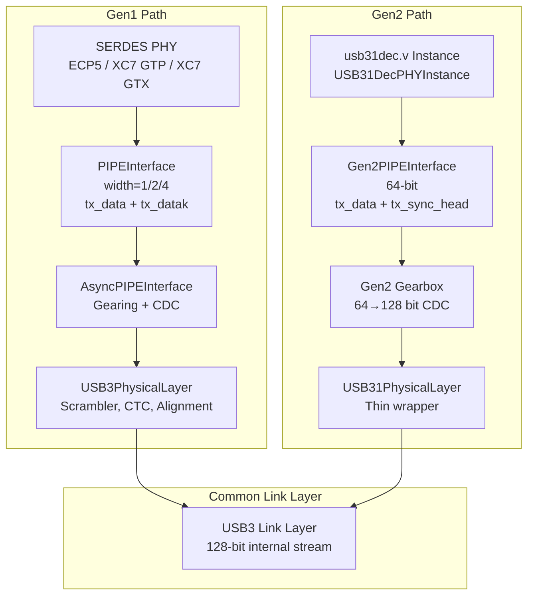
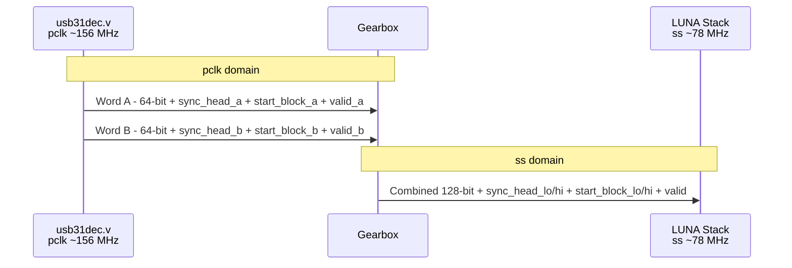
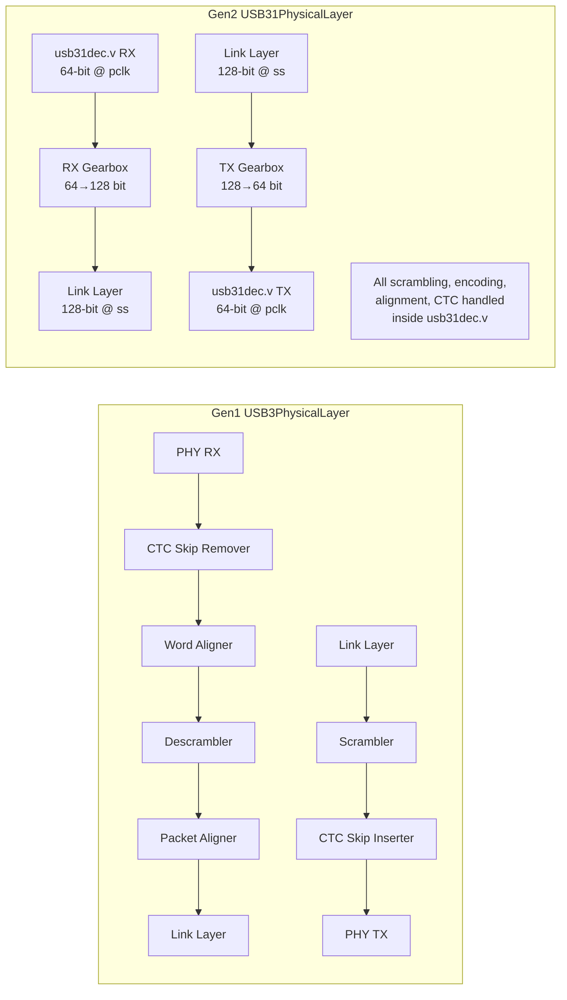
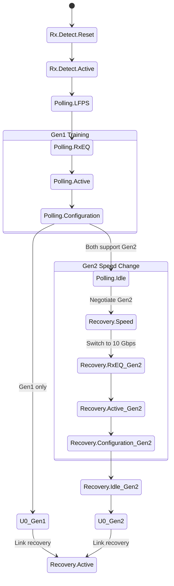
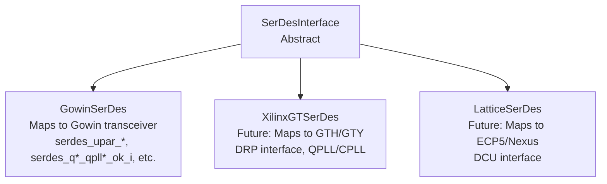
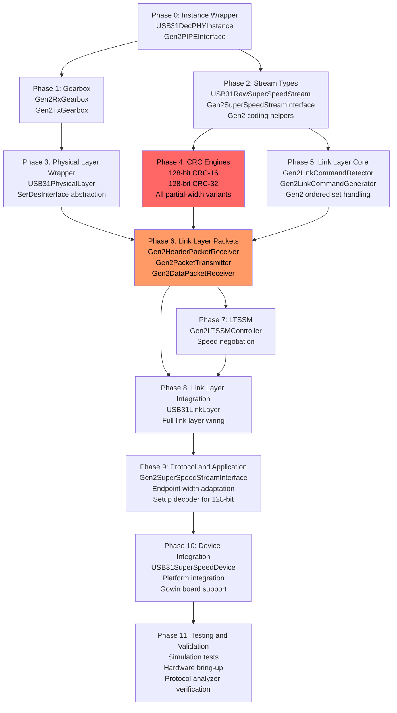
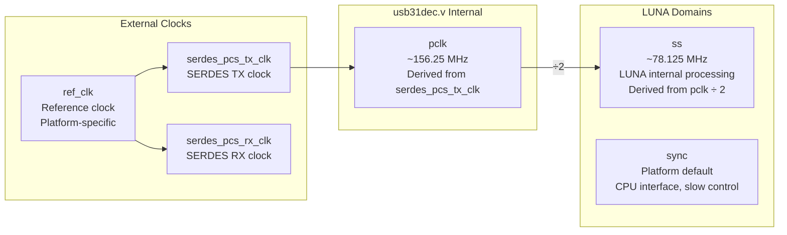

# USB 3.1 Gen2 PHY Integration Plan: `usb31dec.v` into LUNA with 128-bit Internal Data Path

## Table of Contents

1. [Executive Summary](#1-executive-summary)
2. [Architecture Overview](#2-architecture-overview)
3. [usb31dec.v Amaranth Instance Wrapper](#3-usb31decv-amaranth-instance-wrapper)
4. [Gen2 PIPE Interface Definition](#4-gen2-pipe-interface-definition)
5. [64-to-128 Bit Gearbox Design](#5-64-to-128-bit-gearbox-design)
6. [Gen2 Stream Types](#6-gen2-stream-types)
7. [Gen2 Physical Layer Wrapper](#7-gen2-physical-layer-wrapper)
8. [LUNA Link Layer Adaptations for Gen2](#8-luna-link-layer-adaptations-for-gen2)
9. [LTSSM Adaptations](#9-ltssm-adaptations)
10. [SERDES Platform Abstraction](#10-serdes-platform-abstraction)
11. [Modules Made Redundant](#11-modules-made-redundant)
12. [Implementation Phases](#12-implementation-phases)
13. [Clock Domain Strategy](#13-clock-domain-strategy)

---

## 1. Executive Summary

### What We Are Building

This plan describes the integration of the Gowin `usb31dec.v` Verilog PHY module into LUNA's USB3 stack to enable **USB 3.1 Gen2 (10 Gbps SuperSpeed+)** operation. The `usb31dec.v` module handles all Gen2 physical-layer processing — 128b/132b encoding/decoding, Gen2 scrambling/descrambling, block alignment, LFPS, and SERDES register management — exposing a **64-bit Gen2 PIPE interface** at ~156.25 MHz to LUNA.

### Why 128-bit Internal Data Path

LUNA's internal logic operates on a wider data path to bring the clock frequency down to a comfortable level for FPGA fabric:

| Data Path Width | Clock Frequency | FPGA Feasibility |
|----------------|----------------|-----------------|
| 64-bit | ~156.25 MHz | Tight on mid-range FPGAs like Gowin |
| **128-bit** | **~78.125 MHz** | **Comfortable on all FPGAs** |

A **64-to-128 bit gearbox** immediately after the PHY Instance converts from the PHY's 64-bit@156.25 MHz domain to LUNA's 128-bit@78.125 MHz internal domain. The entire LUNA stack from the gearbox output onward operates at **128-bit @ ~78.125 MHz**. The old 32-bit Gen1 path is completely replaced.

### Key Architectural Difference: Gen2 vs Gen1

| Aspect | Gen1 - 5 Gbps | Gen2 - 10 Gbps |
|--------|---------------|----------------|
| Encoding | 8b/10b | 128b/132b |
| Framing | K-characters + ctrl bits | Sync headers + block types |
| Scrambling | 16-bit LFSR, 32-bit wide | 23-bit LFSR, 64-bit wide |
| Data symbols | SHP, SDP, SLC, EPF, END, etc. | Block type field in sync header |
| PIPE data width | 32-bit with datak | 64-bit with sync_head |
| LUNA internal | 32-bit @ 125 MHz | 128-bit @ ~78.125 MHz |

The `usb31dec.v` module handles all Gen2 physical-layer encoding internally. LUNA receives **decoded, descrambled, block-aligned data** via the Gen2 PIPE interface. LUNA is responsible for everything from the link layer upward: LTSSM, link commands, header/data packet framing, CRC, and protocol/application layers.

### Dual PIPE Architecture: Gen1 and Gen2

LUNA will support both Gen1 and Gen2 PIPE interfaces:

- **Gen1 PIPE** — The existing [`PIPEInterface`](gateware/interface/pipe.py:14) with `tx_data`/`rx_data` + `tx_datak`/`rx_datak` using 8b/10b K-character framing. Used by existing SERDES PHYs like [`ECP5SerDesPIPE`](gateware/interface/serdes_phy/ecp5.py), [`XC7GTPSerDesPIPE`](gateware/interface/serdes_phy/xc7_gtp.py), and [`XC7GTXSerDesPIPE`](gateware/interface/serdes_phy/xc7_gtx.py).
- **Gen2 PIPE** — A new `Gen2PIPEInterface` with `tx_data`/`rx_data` + `tx_sync_head`/`rx_sync_head` using 128b/132b block-type framing. Used by the `usb31dec.v` Instance wrapper.

Both interfaces feed into their respective physical layer wrappers, which produce a common internal stream type for the link layer. This allows LUNA to support Gen1-only, Gen2-only, or dual-speed configurations.

---

## 2. Architecture Overview

### Full Stack Diagram

```mermaid
graph TB
    subgraph SERDES Hardware - Gowin FPGA
        SERDES[Gowin SERDES Transceiver<br/>10 Gbps line rate]
    end

    subgraph usb31dec.v Instance - pclk domain ~156.25 MHz
        PHY_INST[usb31dec.v Amaranth Instance<br/>Top module: usb3_1_phy<br/>128b/132b encode/decode<br/>Gen2 scramble/descramble<br/>Block alignment<br/>LFPS generation/detection<br/>PIPE power state mgmt]
    end

    subgraph 64-to-128 Gearbox - CDC bridge
        GEARBOX[Gen2 Gearbox<br/>RX: 2x 64-bit → 1x 128-bit<br/>TX: 1x 128-bit → 2x 64-bit<br/>pclk ~156.25 MHz → ss ~78.125 MHz]
    end

    subgraph LUNA Stack - ss domain ~78.125 MHz, 128-bit
        PHY_WRAP[USB31PhysicalLayer<br/>Instance + Gearbox wrapper<br/>LFPS passthrough<br/>Power state control]

        LINK[USB31LinkLayer<br/>Block-type framing<br/>Link commands - Gen2 format<br/>Header packet Rx/Tx<br/>Data packet Rx/Tx<br/>CRC-16 / CRC-32<br/>Ordered set detection]

        LTSSM_MOD[Gen2 LTSSM Controller<br/>Speed negotiation<br/>Gen2 training sequences<br/>Recovery states]

        PROTO[USB3 Protocol Layer<br/>Endpoint multiplexer<br/>Transaction handling<br/>Link management]

        APP[Application Layer<br/>Control endpoint<br/>Stream endpoints<br/>Descriptors]
    end

    SERDES <--> PHY_INST
    PHY_INST <-->|64-bit Gen2 PIPE<br/>~156.25 MHz| GEARBOX
    GEARBOX <-->|128-bit Gen2 stream<br/>~78.125 MHz| PHY_WRAP
    PHY_WRAP <--> LINK
    LINK <--> LTSSM_MOD
    LINK <--> PROTO
    PROTO <--> APP
```

### Data Path Width at Each Stage

```
SERDES ──[serial 10 Gbps]──► usb31dec.v ──[64-bit @ ~156.25 MHz]──► Gearbox ──[128-bit @ ~78.125 MHz]──► LUNA Stack
```

| Stage | Data Width | Clock | Domain |
|-------|-----------|-------|--------|
| SERDES transceiver | Serial / 88-bit raw | SERDES clocks | serdes |
| usb31dec.v PIPE output | 64-bit + sync headers | ~156.25 MHz | pclk |
| Gearbox output | 128-bit + sync headers | ~78.125 MHz | ss |
| Link layer | 128-bit | ~78.125 MHz | ss |
| Protocol layer | 128-bit | ~78.125 MHz | ss |
| Application layer | 128-bit | ~78.125 MHz | ss |

---

## 3. usb31dec.v Amaranth Instance Wrapper

### Module: `USB31DecPHYInstance`

This module wraps the `usb31dec.v` Verilog file as an Amaranth `Instance`, mapping all ports to Amaranth signals. It lives in a new file at `gateware/interface/usb31dec_phy.py`.

### Complete Amaranth Instance Code

```python
from amaranth import *
from amaranth.hdl import *


class USB31DecPHYInstance(Elaboratable):
    """Amaranth wrapper for the usb31dec.v Verilog PHY module.

    This module instantiates the usb3_1_phy top-level Verilog module
    and exposes all its ports as Amaranth signals organized into
    logical groups.

    The usb31dec.v handles:
      - 128b/132b encoding/decoding for Gen2
      - Gen2 scrambling/descrambling with 23-bit LFSR
      - RX/TX gearboxing between 64-bit and 66-bit blocks
      - Block alignment
      - LFPS detection and generation
      - PIPE power state management for P0-P3
      - RX detect via SERDES CSR
      - DC balance for training sequences
      - SERDES register initialization

    Attributes
    ----------
    pclk : Signal, output
        PIPE clock output from the PHY, ~156.25 MHz.
    pipe : Gen2PIPEInterface
        The Gen2 PIPE-side signals facing LUNA.
    serdes : GowinSerDesInterface
        The SERDES-side signals facing the Gowin transceiver.
    """

    def __init__(self):
        # ── PIPE-side signals (LUNA-facing, Gen2 format) ──

        # Clock
        self.pclk                = Signal()          # output from PHY

        # TX path (LUNA → PHY → wire)
        self.pipe_tx_data        = Signal(64)        # input to PHY
        self.pipe_tx_sync_head   = Signal(4)         # input: 0x3=data, 0xC=control
        self.pipe_tx_start_block = Signal()          # input
        self.pipe_tx_data_valid  = Signal()          # input

        # RX path (wire → PHY → LUNA)
        self.pipe_rx_data        = Signal(64)        # output from PHY
        self.pipe_rx_sync_head   = Signal(4)         # output
        self.pipe_rx_start_block = Signal()          # output
        self.pipe_rx_data_valid  = Signal()          # output

        # Control signals
        self.tx_detect_rx_lpbk   = Signal()          # input
        self.tx_elec_idle        = Signal()          # input
        self.rx_polarity         = Signal()          # input
        self.rx_termination      = Signal()          # input
        self.power_down          = Signal(2)         # input
        self.elasticity_buf_mode = Signal()          # input
        self.phy_resetn          = Signal()          # input (active-low)
        self.ref_clk             = Signal()          # input

        # Status signals
        self.rx_elec_idle        = Signal()          # output
        self.rx_status           = Signal(3)         # output
        self.phy_status          = Signal()          # output
        self.power_present       = Signal()          # output (tied high)

        # ── SERDES-side signals (Gowin FPGA transceiver) ──

        # Register access interface
        self.serdes_upar_clk_i     = Signal()        # input
        self.serdes_upar_resp_i    = Signal()        # input
        self.serdes_upar_rddata_i  = Signal(32)      # input
        self.serdes_upar_rdvld_i   = Signal()        # input
        self.serdes_upar_ready_i   = Signal()        # input
        self.serdes_upar_wren_o    = Signal()        # output
        self.serdes_upar_addr_o    = Signal(24)      # output
        self.serdes_upar_wrdata_o  = Signal(32)      # output
        self.serdes_upar_rden_o    = Signal()        # output
        self.serdes_upar_strb_o    = Signal(8)       # output

        # PLL lock signals
        self.serdes_q0_qpll0_ok_i  = Signal()       # input
        self.serdes_q0_qpll1_ok_i  = Signal()       # input
        self.serdes_q1_qpll0_ok_i  = Signal()       # input
        self.serdes_q1_qpll1_ok_i  = Signal()       # input
        self.serdes_cpll_ok_i      = Signal()        # input

        # TX path
        self.serdes_pcs_tx_clk_i       = Signal()   # input: becomes pclk
        self.serdes_tx_fifo_wrusewd_i  = Signal(5)  # input
        self.serdes_fabric_rstn_o      = Signal()    # output
        self.serdes_fabric_tx_clk_o    = Signal()    # output
        self.serdes_pcs_tx_rst_o       = Signal()    # output
        self.serdes_fabric_tx_vld_o    = Signal()    # output
        self.serdes_txdata_o           = Signal(80)  # output: 64 data + 16 pad

        # RX path
        self.serdes_pcs_rx_clk_i       = Signal()   # input
        self.serdes_pma_rx_lock_i      = Signal()    # input
        self.serdes_rxfifo_aempty_i    = Signal()    # input
        self.serdes_rx_fifo_rdusewd_i  = Signal(5)  # input
        self.serdes_rxdata_i           = Signal(88)  # input: 64 data + 24 overhead
        self.serdes_rx_vld_i           = Signal()    # input
        self.serdes_rxelecidle_i       = Signal()    # input
        self.serdes_astat_i            = Signal(6)   # input
        self.serdes_fabric_rx_clk_o    = Signal()    # output
        self.serdes_pcs_rx_rst_o       = Signal()    # output
        self.serdes_rxfifo_rd_en_o     = Signal()    # output


    def elaborate(self, platform):
        m = Module()

        m.submodules.usb31_phy = Instance("usb3_1_phy",
            # ── Clock ──
            o_pclk                      = self.pclk,

            # ── PIPE TX (inputs to PHY) ──
            i_PipeTxData                = self.pipe_tx_data,
            i_PipeTxSyncHead            = self.pipe_tx_sync_head,
            i_PipeTxStartBlock          = self.pipe_tx_start_block,
            i_PipeTxDataValid           = self.pipe_tx_data_valid,

            # ── PIPE RX (outputs from PHY) ──
            o_PipeRxData                = self.pipe_rx_data,
            o_PipeRxSyncHead            = self.pipe_rx_sync_head,
            o_PipeRxStartBlock          = self.pipe_rx_start_block,
            o_PipeRxDataValid           = self.pipe_rx_data_valid,

            # ── PIPE Control ──
            i_TxDetectRx_loopback       = self.tx_detect_rx_lpbk,
            i_TxElecIdle                = self.tx_elec_idle,
            i_RxPolarity                = self.rx_polarity,
            i_RxTermination             = self.rx_termination,
            i_PowerDown                 = self.power_down,
            i_ElasticityBufferMode      = self.elasticity_buf_mode,
            i_phy_resetn                = self.phy_resetn,
            i_ref_clk                   = self.ref_clk,

            # ── PIPE Status ──
            o_RxElecIdle                = self.rx_elec_idle,
            o_RxStatus                  = self.rx_status,
            o_PhyStatus                 = self.phy_status,
            o_PowerPresent              = self.power_present,

            # ── SERDES Register Access ──
            i_serdes_upar_clk_i         = self.serdes_upar_clk_i,
            i_serdes_upar_resp_i        = self.serdes_upar_resp_i,
            i_serdes_upar_rddata_i      = self.serdes_upar_rddata_i,
            i_serdes_upar_rdvld_i       = self.serdes_upar_rdvld_i,
            i_serdes_upar_ready_i       = self.serdes_upar_ready_i,
            o_serdes_upar_wren_o        = self.serdes_upar_wren_o,
            o_serdes_upar_addr_o        = self.serdes_upar_addr_o,
            o_serdes_upar_wrdata_o      = self.serdes_upar_wrdata_o,
            o_serdes_upar_rden_o        = self.serdes_upar_rden_o,
            o_serdes_upar_strb_o        = self.serdes_upar_strb_o,

            # ── SERDES PLL Lock ──
            i_serdes_q0_qpll0_ok_i      = self.serdes_q0_qpll0_ok_i,
            i_serdes_q0_qpll1_ok_i      = self.serdes_q0_qpll1_ok_i,
            i_serdes_q1_qpll0_ok_i      = self.serdes_q1_qpll0_ok_i,
            i_serdes_q1_qpll1_ok_i      = self.serdes_q1_qpll1_ok_i,
            i_serdes_cpll_ok_i          = self.serdes_cpll_ok_i,

            # ── SERDES TX ──
            i_serdes_pcs_tx_clk_i       = self.serdes_pcs_tx_clk_i,
            i_serdes_tx_fifo_wrusewd_i  = self.serdes_tx_fifo_wrusewd_i,
            o_serdes_fabric_rstn_o      = self.serdes_fabric_rstn_o,
            o_serdes_fabric_tx_clk_o    = self.serdes_fabric_tx_clk_o,
            o_serdes_pcs_tx_rst_o       = self.serdes_pcs_tx_rst_o,
            o_serdes_fabric_tx_vld_o    = self.serdes_fabric_tx_vld_o,
            o_serdes_txdata_o           = self.serdes_txdata_o,

            # ── SERDES RX ──
            i_serdes_pcs_rx_clk_i       = self.serdes_pcs_rx_clk_i,
            i_serdes_pma_rx_lock_i      = self.serdes_pma_rx_lock_i,
            i_serdes_rxfifo_aempty_i    = self.serdes_rxfifo_aempty_i,
            i_serdes_rx_fifo_rdusewd_i  = self.serdes_rx_fifo_rdusewd_i,
            i_serdes_rxdata_i           = self.serdes_rxdata_i,
            i_serdes_rx_vld_i           = self.serdes_rx_vld_i,
            i_serdes_rxelecidle_i       = self.serdes_rxelecidle_i,
            i_serdes_astat_i            = self.serdes_astat_i,
            o_serdes_fabric_rx_clk_o    = self.serdes_fabric_rx_clk_o,
            o_serdes_pcs_rx_rst_o       = self.serdes_pcs_rx_rst_o,
            o_serdes_rxfifo_rd_en_o     = self.serdes_rxfifo_rd_en_o,
        )

        # Add the Verilog source file to the platform
        platform.add_file("usb31dec.v", open("usb31dec.v").read())

        return m
```

### Port Mapping Summary

| Signal Group | Direction | Width | Description |
|-------------|-----------|-------|-------------|
| `pclk` | PHY → LUNA | 1 | PIPE clock ~156.25 MHz |
| `PipeTxData` | LUNA → PHY | 64 | TX data |
| `PipeTxSyncHead` | LUNA → PHY | 4 | TX sync header |
| `PipeTxStartBlock` | LUNA → PHY | 1 | TX block start |
| `PipeTxDataValid` | LUNA → PHY | 1 | TX data valid |
| `PipeRxData` | PHY → LUNA | 64 | RX data |
| `PipeRxSyncHead` | PHY → LUNA | 4 | RX sync header |
| `PipeRxStartBlock` | PHY → LUNA | 1 | RX block start |
| `PipeRxDataValid` | PHY → LUNA | 1 | RX data valid |
| Control signals | LUNA → PHY | various | Power, idle, polarity, etc. |
| Status signals | PHY → LUNA | various | RxStatus, PhyStatus, etc. |
| SERDES signals | bidirectional | various | Gowin transceiver interface |

---

## 4. Gen2 PIPE Interface Definition

### Why a New Interface

The existing [`PIPEInterface`](gateware/interface/pipe.py:14) is designed for Gen1 8b/10b encoding with `tx_datak`/`rx_datak` control bits. Gen2 uses 128b/132b block encoding with **sync headers** instead of K-characters. The data semantics are fundamentally different:

| Feature | Gen1 PIPEInterface | Gen2 PIPEInterface |
|---------|-------------------|-------------------|
| Data width | 8/16/32-bit | 64-bit |
| Control | `datak` per byte | `sync_head` per block |
| Block marker | N/A | `start_block` |
| Data valid | `rx_valid` | `data_valid` |
| Encoding info | K-char flags | Sync header: 0x3=data, 0xC=control |

### New Class: `Gen2PIPEInterface`

File: `gateware/interface/gen2_pipe.py`

```python
from amaranth import *


class Gen2PIPEInterface:
    """PIPE interface for USB 3.1 Gen2 with 128b/132b block encoding.

    Unlike the Gen1 PIPEInterface which uses datak bits for K-character
    identification, Gen2 uses sync headers to identify block types:
      - 0x3 (0b0011): Data block
      - 0xC (0b1100): Control block (ordered sets, framing)

    The start_block signal marks the beginning of a new 128b/132b block.
    Each block is 132 bits: 4-bit sync header + 128 bits of payload,
    delivered as two 64-bit words over the PIPE interface.

    Attributes
    ----------
    pclk : Signal, output
        PIPE clock from PHY, ~156.25 MHz.
    tx_data : Signal(64), input
        Transmit data bus.
    tx_sync_head : Signal(4), input
        Transmit sync header. 0x3 for data block, 0xC for control block.
    tx_start_block : Signal, input
        Asserted on the first word of a new block.
    tx_data_valid : Signal, input
        Transmit data valid.
    rx_data : Signal(64), output
        Receive data bus.
    rx_sync_head : Signal(4), output
        Receive sync header.
    rx_start_block : Signal, output
        Asserted on the first word of a received block.
    rx_data_valid : Signal, output
        Receive data valid.
    """

    # Sync header constants
    SYNC_DATA    = 0x3   # Data block
    SYNC_CONTROL = 0xC   # Control block (ordered sets, framing)

    def __init__(self):
        # Clock
        self.pclk             = Signal()

        # TX path
        self.tx_data          = Signal(64)
        self.tx_sync_head     = Signal(4)
        self.tx_start_block   = Signal()
        self.tx_data_valid    = Signal()

        # RX path
        self.rx_data          = Signal(64)
        self.rx_sync_head     = Signal(4)
        self.rx_start_block   = Signal()
        self.rx_data_valid    = Signal()

        # Control signals (shared with Gen1)
        self.tx_detect_rx_lpbk  = Signal()
        self.tx_elec_idle       = Signal()
        self.rx_polarity        = Signal()
        self.rx_termination     = Signal()
        self.power_down         = Signal(2)
        self.elasticity_buf_mode = Signal()
        self.phy_resetn         = Signal()
        self.ref_clk            = Signal()

        # Status signals (shared with Gen1)
        self.rx_elec_idle       = Signal()
        self.rx_status          = Signal(3)
        self.phy_status         = Signal()
        self.power_present      = Signal()
```

### Relationship to Gen1 PIPEInterface



---

## 5. 64-to-128 Bit Gearbox Design

### Purpose

The gearbox is the critical bridge between the `usb31dec.v` PHY's 64-bit@~156.25 MHz PIPE interface and LUNA's 128-bit@~78.125 MHz internal domain. It performs:

1. **Clock domain crossing** from `pclk` (~156.25 MHz) to `ss` (~78.125 MHz)
2. **Data width conversion** from 64-bit to 128-bit
3. **Sideband signal aggregation** for `sync_head`, `start_block`, and `data_valid`

### Module: `Gen2Gearbox`

File: `gateware/interface/gen2_gearbox.py`

### RX Path: 64-bit → 128-bit

The RX gearbox accumulates two consecutive 64-bit words from the PHY into one 128-bit word for LUNA.



#### RX Gearbox Logic

```python
class Gen2RxGearbox(Elaboratable):
    """Converts 64-bit@pclk to 128-bit@ss for the RX path.

    In the pclk domain, we alternate between capturing the low and high
    halves of the 128-bit output word. A toggle signal tracks which half
    we are capturing. When the high half is captured, the full 128-bit
    word is written into an async FIFO for the ss domain to consume.

    Sideband signals (sync_head, start_block, data_valid) are captured
    for both halves and presented as paired signals on the output.
    """

    def __init__(self):
        # ── Input (pclk domain) ──
        self.rx_data          = Signal(64)
        self.rx_sync_head     = Signal(4)
        self.rx_start_block   = Signal()
        self.rx_data_valid    = Signal()

        # ── Output (ss domain) ──
        self.source_data      = Signal(128)
        self.source_sync_head = Signal(8)    # [3:0]=low word, [7:4]=high word
        self.source_start_block = Signal(2)  # [0]=low word, [1]=high word
        self.source_valid     = Signal()

    def elaborate(self, platform):
        m = Module()

        # pclk domain: accumulate two 64-bit words
        toggle = Signal()  # 0=capturing low half, 1=capturing high half

        # Holding register for the low half
        low_data        = Signal(64)
        low_sync_head   = Signal(4)
        low_start_block = Signal()
        low_valid       = Signal()

        m.d.pclk += toggle.eq(~toggle)

        # Capture low half on even cycles
        with m.If(~toggle):
            m.d.pclk += [
                low_data        .eq(self.rx_data),
                low_sync_head   .eq(self.rx_sync_head),
                low_start_block .eq(self.rx_start_block),
                low_valid       .eq(self.rx_data_valid),
            ]

        # Async FIFO: pclk → ss
        fifo_data = Signal(128 + 8 + 2 + 2)  # data + sync_head + start_block + valid
        m.submodules.rx_fifo = rx_fifo = AsyncFIFOBuffered(
            width=len(fifo_data), depth=4,
            w_domain="pclk", r_domain="ss"
        )

        # Write on high-half cycles (toggle=1) when we have a complete pair
        m.d.comb += [
            rx_fifo.w_data.eq(Cat(
                low_data, self.rx_data,                    # 128 bits
                low_sync_head, self.rx_sync_head,          # 8 bits
                low_start_block, self.rx_start_block,      # 2 bits
                low_valid, self.rx_data_valid,             # 2 bits
            )),
            rx_fifo.w_en.eq(toggle & self.rx_data_valid),
        ]

        # Read side (ss domain)
        m.d.comb += [
            self.source_data        .eq(rx_fifo.r_data[0:128]),
            self.source_sync_head   .eq(rx_fifo.r_data[128:136]),
            self.source_start_block .eq(rx_fifo.r_data[136:138]),
            self.source_valid       .eq(rx_fifo.r_level > 0),
            rx_fifo.r_en            .eq(1),
        ]

        return m
```

### TX Path: 128-bit → 64-bit

The TX gearbox splits one 128-bit word from LUNA into two consecutive 64-bit words for the PHY.

```python
class Gen2TxGearbox(Elaboratable):
    """Converts 128-bit@ss to 64-bit@pclk for the TX path.

    The ss domain writes 128-bit words into an async FIFO. The pclk
    domain reads from the FIFO and alternately outputs the low and
    high 64-bit halves.
    """

    def __init__(self):
        # ── Input (ss domain) ──
        self.sink_data        = Signal(128)
        self.sink_sync_head   = Signal(8)    # [3:0]=low, [7:4]=high
        self.sink_start_block = Signal(2)    # [0]=low, [1]=high
        self.sink_valid       = Signal()
        self.sink_ready       = Signal()

        # ── Output (pclk domain) ──
        self.tx_data          = Signal(64)
        self.tx_sync_head     = Signal(4)
        self.tx_start_block   = Signal()
        self.tx_data_valid    = Signal()

    def elaborate(self, platform):
        m = Module()

        fifo_data = Signal(128 + 8 + 2)
        m.submodules.tx_fifo = tx_fifo = AsyncFIFOBuffered(
            width=len(fifo_data), depth=4,
            w_domain="ss", r_domain="pclk"
        )

        # Write side (ss domain)
        m.d.comb += [
            tx_fifo.w_data.eq(Cat(
                self.sink_data,
                self.sink_sync_head,
                self.sink_start_block,
            )),
            tx_fifo.w_en    .eq(self.sink_valid),
            self.sink_ready .eq(tx_fifo.w_rdy),
        ]

        # Read side (pclk domain): alternate low/high halves
        toggle = Signal()  # 0=output low half, 1=output high half
        latched = Signal(len(fifo_data))

        m.d.pclk += toggle.eq(~toggle)

        # Latch the full word on even cycles
        with m.If(~toggle):
            m.d.pclk += latched.eq(tx_fifo.r_data)
            m.d.comb += tx_fifo.r_en.eq(1)

        # Output the appropriate half
        with m.If(~toggle):
            m.d.comb += [
                self.tx_data        .eq(tx_fifo.r_data[0:64]),
                self.tx_sync_head   .eq(tx_fifo.r_data[128:132]),
                self.tx_start_block .eq(tx_fifo.r_data[136]),
                self.tx_data_valid  .eq(1),
            ]
        with m.Else():
            m.d.comb += [
                self.tx_data        .eq(latched[64:128]),
                self.tx_sync_head   .eq(latched[132:136]),
                self.tx_start_block .eq(latched[137]),
                self.tx_data_valid  .eq(1),
            ]

        return m
```

### Gearbox Timing Diagram

```
pclk:  ┌─┐ ┌─┐ ┌─┐ ┌─┐ ┌─┐ ┌─┐ ┌─┐ ┌─┐
       │ │ │ │ │ │ │ │ │ │ │ │ │ │ │ │
       └─┘ └─┘ └─┘ └─┘ └─┘ └─┘ └─┘ └─┘

ss:    ┌───┐   ┌───┐   ┌───┐   ┌───┐
       │   │   │   │   │   │   │   │
       └───┘   └───┘   └───┘   └───┘

RX:    ─A0──A1──B0──B1──C0──C1──D0──D1─  (64-bit @ pclk)
       ────A────────B────────C────────D─  (128-bit @ ss)

TX:    ────W────────X────────Y────────Z─  (128-bit @ ss)
       ─W0──W1──X0──X1──Y0──Y1──Z0──Z1─  (64-bit @ pclk)
```

### Handling Edge Cases

| Scenario | Handling |
|----------|---------|
| PHY not valid (`rx_data_valid=0`) | Gearbox outputs invalid; LUNA ignores |
| Odd number of valid words | Low half captured, high half marked invalid |
| `start_block` on high word | Propagated via `source_start_block[1]` |
| TX backpressure | `sink_ready` deasserted when FIFO full |
| Reset / power state change | FIFO flushed on domain reset |

---

## 6. Gen2 Stream Types

### New Stream: `USB31RawSuperSpeedStream`

The existing [`USBRawSuperSpeedStream`](gateware/usb/stream.py:261) uses `data` + `ctrl` fields designed for Gen1 8b/10b K-character framing. Gen2 requires a fundamentally different stream type with **sync headers** instead of ctrl bits.

File: `gateware/usb/usb3/stream31.py`

```python
from amaranth import *
from ...stream import StreamInterface


class USB31RawSuperSpeedStream(StreamInterface):
    """Stream interface for USB 3.1 Gen2 128b/132b block-encoded data.

    Unlike the Gen1 USBRawSuperSpeedStream which carries per-byte ctrl
    flags for K-character identification, this Gen2 stream carries:

    - data: 128-bit payload (two 64-bit halves of a 128b/132b block)
    - sync_head: 8-bit sync header field (4 bits per 64-bit half)
        - 0x3 = data block
        - 0xC = control block (ordered sets, framing)
    - start_block: 2-bit block start markers (1 per 64-bit half)

    The 128-bit data path carries one complete 128b/132b block per
    clock cycle at ~78.125 MHz, providing 10 Gbps throughput.

    Block Type Identification
    -------------------------
    In Gen2, packet framing is identified by the sync header and
    block type field within control blocks, NOT by K-characters:

    - Data block (sync=0x3): Raw data payload
    - Control block (sync=0xC): Contains a block type field in
      bits [7:0] that identifies the content:
        - 0x1E: Ordered set block
        - 0x33: Header packet start
        - 0x66: Data packet start
        - 0x78: End good
        - 0x87: End bad
        - etc.
    """

    # Sync header constants
    SYNC_DATA    = 0x3
    SYNC_CONTROL = 0xC

    # Block type constants (in control blocks, bits [7:0])
    BLOCK_TYPE_ORDERED_SET  = 0x1E
    BLOCK_TYPE_HP_START     = 0x33
    BLOCK_TYPE_DP_START     = 0x66
    BLOCK_TYPE_END_GOOD     = 0x78
    BLOCK_TYPE_END_BAD      = 0x87
    BLOCK_TYPE_LINK_CMD     = 0x4B

    def __init__(self):
        super().__init__(
            payload_width=128,
            extra_fields=[
                ('sync_head',    8),   # 4 bits per 64-bit half
                ('start_block',  2),   # 1 per 64-bit half
            ]
        )

    def is_data_block(self):
        """Returns an Amaranth expression that is true when this is a data block."""
        return self.sync_head[0:4] == self.SYNC_DATA

    def is_control_block(self):
        """Returns an Amaranth expression that is true when this is a control block."""
        return self.sync_head[0:4] == self.SYNC_CONTROL

    def block_type(self):
        """Returns the block type field from a control block (bits [7:0] of data)."""
        return self.data[0:8]
```

### Comparison: Gen1 vs Gen2 Stream Types

| Feature | `USBRawSuperSpeedStream` | `USB31RawSuperSpeedStream` |
|---------|-------------------------|---------------------------|
| Data width | 32-bit (4 bytes) | 128-bit (16 bytes) |
| Control field | `ctrl` — 4-bit, 1 per byte | `sync_head` — 8-bit, 4 per half |
| Block markers | N/A | `start_block` — 2-bit |
| Framing detection | K-char pattern matching | Sync header + block type |
| Clock frequency | 125 MHz | ~78.125 MHz |
| Throughput | 4 Gbps effective | ~10 Gbps effective |

### Gen2 SuperSpeedStreamInterface

The application-layer stream also needs a 128-bit variant:

```python
class Gen2SuperSpeedStreamInterface(StreamInterface):
    """Application-layer stream interface for Gen2 128-bit data path.

    This is the Gen2 equivalent of SuperSpeedStreamInterface, carrying
    decoded payload data between the link and protocol/application layers.
    """

    def __init__(self):
        super().__init__(payload_width=128, valid_width=16)
```

---

## 7. Gen2 Physical Layer Wrapper

### Module: `USB31PhysicalLayer`

This module wraps the `USB31DecPHYInstance` + `Gen2Gearbox` and presents a clean 128-bit stream interface to the link layer. It is the Gen2 equivalent of the existing [`USB3PhysicalLayer`](gateware/usb/usb3/physical/layer.py:20).

File: `gateware/usb/usb3/physical/gen2_layer.py`

```python
from amaranth import *
from .gen2_gearbox import Gen2RxGearbox, Gen2TxGearbox
from ...stream import USB31RawSuperSpeedStream


class USB31PhysicalLayer(Elaboratable):
    """Physical layer wrapper for USB 3.1 Gen2 using usb31dec.v.

    This module combines:
    1. The usb31dec.v Verilog Instance (handles all Gen2 PHY processing)
    2. The 64→128 bit gearbox (clock domain crossing + width conversion)
    3. LFPS and power state control passthrough

    Unlike the Gen1 USB3PhysicalLayer, this module does NOT contain:
    - Scrambler/Descrambler (handled by usb31dec.v)
    - CTC Skip insertion/removal (handled by usb31dec.v)
    - Word alignment (handled by usb31dec.v)
    - 8b/10b encoding/decoding (Gen2 uses 128b/132b, handled by usb31dec.v)

    Attributes
    ----------
    sink : USB31RawSuperSpeedStream, input
        Data from link layer to be transmitted.
    source : USB31RawSuperSpeedStream, output
        Data from PHY to link layer.
    ready : Signal, output
        PHY is ready for operation.
    """

    def __init__(self, *, phy_instance):
        self._phy = phy_instance

        # ── Data streams (128-bit, ss domain) ──
        self.sink   = USB31RawSuperSpeedStream()
        self.source = USB31RawSuperSpeedStream()

        # ── Physical link state ──
        self.ready                = Signal()
        self.engage_terminations  = Signal()
        self.tx_electrical_idle   = Signal()
        self.invert_rx_polarity   = Signal()
        self.vbus_present         = Signal()

        # ── Link partner detection ──
        self.perform_rx_detection     = Signal()
        self.link_partner_detected    = Signal()
        self.no_link_partner_detected = Signal()

        # ── LFPS control / detection ──
        # Note: LFPS is handled internally by usb31dec.v via the
        # TxElecIdle and TxDetectRx_loopback signals. These signals
        # provide a higher-level interface for the LTSSM.
        self.send_lfps_polling      = Signal()
        self.lfps_cycles_sent       = Signal(16)
        self.lfps_polling_detected  = Signal()
        self.lfps_reset_detected    = Signal()

        # ── Power state ──
        self.power_down             = Signal(2)

    def elaborate(self, platform):
        m = Module()
        phy = self._phy

        # ── Gearbox submodules ──
        m.submodules.rx_gearbox = rx_gb = Gen2RxGearbox()
        m.submodules.tx_gearbox = tx_gb = Gen2TxGearbox()

        # ── Connect PHY RX → RX Gearbox → source ──
        m.d.comb += [
            # PHY outputs → gearbox inputs (pclk domain)
            rx_gb.rx_data        .eq(phy.pipe_rx_data),
            rx_gb.rx_sync_head   .eq(phy.pipe_rx_sync_head),
            rx_gb.rx_start_block .eq(phy.pipe_rx_start_block),
            rx_gb.rx_data_valid  .eq(phy.pipe_rx_data_valid),

            # Gearbox outputs → LUNA source (ss domain)
            self.source.data        .eq(rx_gb.source_data),
            self.source.sync_head   .eq(rx_gb.source_sync_head),
            self.source.start_block .eq(rx_gb.source_start_block),
            self.source.valid       .eq(rx_gb.source_valid),
        ]

        # ── Connect sink → TX Gearbox → PHY TX ──
        m.d.comb += [
            # LUNA sink → gearbox inputs (ss domain)
            tx_gb.sink_data        .eq(self.sink.data),
            tx_gb.sink_sync_head   .eq(self.sink.sync_head),
            tx_gb.sink_start_block .eq(self.sink.start_block),
            tx_gb.sink_valid       .eq(self.sink.valid),
            self.sink.ready        .eq(tx_gb.sink_ready),

            # Gearbox outputs → PHY inputs (pclk domain)
            phy.pipe_tx_data        .eq(tx_gb.tx_data),
            phy.pipe_tx_sync_head   .eq(tx_gb.tx_sync_head),
            phy.pipe_tx_start_block .eq(tx_gb.tx_start_block),
            phy.pipe_tx_data_valid  .eq(tx_gb.tx_data_valid),
        ]

        # ── Control signal passthrough ──
        m.d.comb += [
            phy.rx_termination     .eq(self.engage_terminations),
            phy.rx_polarity        .eq(self.invert_rx_polarity),
            phy.tx_elec_idle       .eq(self.tx_electrical_idle),
            phy.power_down         .eq(self.power_down),
            self.vbus_present      .eq(phy.power_present),
            self.ready             .eq(~phy.phy_status),  # Simplified
        ]

        # ── LFPS handling ──
        # usb31dec.v handles LFPS internally. The LTSSM controls LFPS
        # via TxElecIdle and TxDetectRx_loopback. RxElecIdle indicates
        # LFPS reception.
        m.d.comb += [
            self.lfps_polling_detected .eq(~phy.rx_elec_idle),
            phy.tx_detect_rx_lpbk      .eq(self.perform_rx_detection),
        ]

        return m
```

### Physical Layer Comparison



---

## 8. LUNA Link Layer Adaptations for Gen2

### Fundamental Change: Block-Type Framing

The most significant change in the link layer is the shift from **K-character-based framing** to **block-type-based framing**.

#### Gen1 Framing (Current LUNA)

In Gen1, packet boundaries are identified by K-character patterns in the `ctrl` bits:

```
Header Packet:  [SHP SHP SHP EPF] [DW0] [DW1] [DW2] [DW3]
                 ctrl=0b1111       ctrl=0       ...

Data Packet:    [SDP SDP SDP EPF] [payload...] [CRC32] [END END END EPF]
                 ctrl=0b1111                            ctrl=0b1111

Link Command:   [SLC SLC SLC EPF] [cmd_word]
                 ctrl=0b1111       ctrl=0
```

The existing code uses [`stream_matches_symbols()`](gateware/usb/usb3/physical/coding.py:76) to detect these patterns by comparing both `data` and `ctrl` fields.

#### Gen2 Framing (New)

In Gen2, packet boundaries are identified by the **sync header** and **block type field** within control blocks:

```
Control block (sync_head = 0xC):
  bits [7:0]   = block_type
  bits [127:8] = block-type-specific content

Data block (sync_head = 0x3):
  bits [127:0] = raw data payload
```

Key block types for USB3 link layer:

| Block Type | Value | Gen1 Equivalent | Content |
|-----------|-------|-----------------|---------|
| Header Start | 0x33 | SHP SHP SHP EPF | Marks start of header packet |
| Data Start | 0x66 | SDP SDP SDP EPF | Marks start of data packet payload |
| End Good | 0x78 | END END END EPF | Good end of packet |
| End Bad | 0x87 | EDB EDB EDB EPF | Bad end of packet / abort |
| Link Command | 0x4B | SLC SLC SLC EPF | Link command block |
| Ordered Set | 0x1E | COM-based patterns | Training sequences |

### New Gen2 Coding Module

File: `gateware/usb/usb3/physical/gen2_coding.py`

```python
from amaranth import *


class Gen2BlockType:
    """Constants and helpers for Gen2 128b/132b block type identification."""

    # Sync header values
    SYNC_DATA    = 0x3
    SYNC_CONTROL = 0xC

    # Block type field values (bits [7:0] of control blocks)
    ORDERED_SET  = 0x1E
    HP_START     = 0x33   # Header Packet Start
    DP_START     = 0x66   # Data Packet Start
    END_GOOD     = 0x78   # Good end of packet
    END_BAD      = 0x87   # Bad end of packet
    LINK_CMD     = 0x4B   # Link Command


def stream_is_control_block(stream):
    """Returns true when the stream carries a control block."""
    return stream.valid & (stream.sync_head[0:4] == Gen2BlockType.SYNC_CONTROL)


def stream_is_data_block(stream):
    """Returns true when the stream carries a data block."""
    return stream.valid & (stream.sync_head[0:4] == Gen2BlockType.SYNC_DATA)


def stream_block_type_matches(stream, block_type):
    """Returns true when the stream carries a control block of the given type."""
    return (
        stream.valid &
        (stream.sync_head[0:4] == Gen2BlockType.SYNC_CONTROL) &
        (stream.data[0:8] == block_type)
    )
```

### Link Command Adaptations

#### Gen1 Link Commands (Current)

The existing [`LinkCommandDetector`](gateware/usb/usb3/link/command.py) uses a 2-state FSM:
1. Wait for `SLC SLC SLC EPF` pattern (4 bytes, 1 cycle at 32-bit)
2. Parse the next 32-bit word as the command

The [`LinkCommandGenerator`](gateware/usb/usb3/link/command.py:129) emits the same in 2 cycles.

#### Gen2 Link Commands (New)

In Gen2, a link command is a **single control block**:

```
[sync=0xC] [block_type=0x4B] [cmd_word_0: 16-bit] [cmd_word_0_replica: 16-bit] [padding: 88 bits]
```

At 128-bit data path, the entire link command fits in **one cycle**. The FSM collapses to a single-cycle combinational detector:

```python
class Gen2LinkCommandDetector(Elaboratable):
    """Single-cycle link command detector for Gen2 128-bit data path."""

    def __init__(self):
        self.sink        = USB31RawSuperSpeedStream()
        self.new_command = Signal()
        self.command     = Signal(3)
        self.subtype     = Signal(4)

    def elaborate(self, platform):
        m = Module()

        is_link_cmd = stream_block_type_matches(
            self.sink, Gen2BlockType.LINK_CMD
        )

        # In Gen2, the link command word is in bits [23:8] of the block
        cmd_word    = self.sink.data[8:24]
        cmd_replica = self.sink.data[24:40]

        with m.If(is_link_cmd & (cmd_word == cmd_replica)):
            m.d.comb += [
                self.new_command .eq(1),
                self.command     .eq(cmd_word[0:3]),
                self.subtype     .eq(cmd_word[3:7]),
            ]

        return m
```

### Header Packet Reception

#### Gen1 (Current)

The [`RawHeaderPacketReceiver`](gateware/usb/usb3/link/receiver.py:19) uses a multi-state FSM:
- `WAIT_FOR_HPSTART` → detect `SHP SHP SHP EPF`
- `RECEIVE_DW0` through `RECEIVE_DW3` → capture 4 × 32-bit words
- `CHECK_PACKET` → validate CRC-5 and CRC-16

At 32-bit, this takes 5+ cycles per header packet.

#### Gen2 at 128-bit (New)

At 128-bit, the entire header packet (128 bits = 4 × DW) arrives in a **single data block** immediately following the header start control block. The FSM simplifies dramatically:

```python
class Gen2HeaderPacketReceiver(Elaboratable):
    """Header packet receiver for Gen2 128-bit data path.

    In Gen2 at 128-bit width:
    - Cycle N:   Control block with block_type=HP_START
    - Cycle N+1: Data block containing all 4 DWs (128 bits)

    The entire header is captured in just 2 cycles.
    """

    def __init__(self):
        self.sink     = USB31RawSuperSpeedStream()
        self.packet   = HeaderPacket()
        self.new_packet = Signal()
        self.bad_packet = Signal()

    def elaborate(self, platform):
        m = Module()

        # CRC-16 generator for 128-bit input
        m.submodules.crc16 = crc16 = Gen2HeaderPacketCRC()

        with m.FSM(domain="ss"):
            with m.State("WAIT_FOR_HP_START"):
                m.d.comb += crc16.clear.eq(1)

                is_hp_start = stream_block_type_matches(
                    self.sink, Gen2BlockType.HP_START
                )
                with m.If(is_hp_start):
                    m.next = "RECEIVE_HEADER"

            with m.State("RECEIVE_HEADER"):
                with m.If(self.sink.valid & stream_is_data_block(self.sink)):
                    # All 4 DWs arrive in one 128-bit word
                    m.d.ss += [
                        self.packet.dw0 .eq(self.sink.data[0:32]),
                        self.packet.dw1 .eq(self.sink.data[32:64]),
                        self.packet.dw2 .eq(self.sink.data[64:96]),
                        # DW3 contains link-layer fields
                        self.packet.crc16           .eq(self.sink.data[96:112]),
                        self.packet.sequence_number .eq(self.sink.data[112:115]),
                        self.packet.hub_depth       .eq(self.sink.data[118:121]),
                        self.packet.crc5            .eq(self.sink.data[123:128]),
                    ]
                    # Feed all 96 bits (DW0-DW2) to CRC in one cycle
                    m.d.comb += [
                        crc16.data_input .eq(self.sink.data[0:96]),
                        crc16.advance_crc.eq(1),
                    ]
                    m.next = "CHECK_PACKET"

            with m.State("CHECK_PACKET"):
                # Validate CRC-5 and CRC-16
                # ... (similar to Gen1 but single-cycle)
                m.next = "WAIT_FOR_HP_START"

        return m
```

### Data Packet Reception

At 128-bit, the data packet framing changes similarly:

- **Start**: Control block with `block_type=DP_START`
- **Payload**: Sequence of data blocks (128 bits each)
- **End**: Control block with `block_type=END_GOOD` or `END_BAD`

The CRC-32 must process 128 bits per cycle, requiring a 128-bit-wide CRC engine (see the [wide-datapath analysis](wide-datapath-analysis.md) for CRC generation approach).

### Ordered Set Detection

Gen2 ordered sets are encoded as control blocks with `block_type=ORDERED_SET`. The training sequence data is in the remaining 120 bits of the block. At 128-bit width, an entire ordered set block arrives in one cycle.

```python
class Gen2TSDetector(Elaboratable):
    """Gen2 training sequence detector for 128-bit data path.

    Gen2 training sequences use control blocks with block_type=0x1E.
    The training set data occupies bits [127:8] of the block.
    """

    def __init__(self):
        self.sink           = USB31RawSuperSpeedStream()
        self.ts1_detected   = Signal()
        self.ts2_detected   = Signal()
        self.tseq_detected  = Signal()

    def elaborate(self, platform):
        m = Module()

        is_ordered_set = stream_block_type_matches(
            self.sink, Gen2BlockType.ORDERED_SET
        )

        # Gen2 TS1/TS2 identification is via the ordered set content
        # The specific patterns differ from Gen1 (no K-characters)
        with m.If(is_ordered_set):
            os_data = self.sink.data[8:128]
            # ... pattern matching for Gen2 training sequences

        return m
```

### Summary of Link Layer Changes

| Component | Gen1 Approach | Gen2 Approach | Complexity |
|-----------|--------------|---------------|------------|
| Framing detection | K-char pattern match on `ctrl` | Sync header + block type check | Simpler |
| Link commands | 2-cycle FSM | Single-cycle combinational | Simpler |
| Header Rx | 5+ cycle FSM | 2-cycle FSM | Simpler |
| Data Rx | Multi-cycle with 32-bit CRC | Multi-cycle with 128-bit CRC | Similar |
| Ordered sets | Multi-word pattern match | Single-block match | Simpler |
| CRC-16 | 32-bit input | 96-bit input (3 DWs at once) | Harder |
| CRC-32 | 32-bit input + partials | 128-bit input + partials | Harder |
| Transmitter | Multi-cycle framing insertion | Block-based framing | Different |

---

## 9. LTSSM Adaptations

### Current Gen1 LTSSM

The existing [`LTSSMController`](gateware/usb/usb3/link/ltssm.py:21) implements the USB 3.0 link training state machine. It is a pure control FSM with no data path — it only uses control signals and detection strobes. Key states:

```
Rx.Detect.Reset → Rx.Detect.Active → Polling.LFPS → Polling.RxEQ →
Polling.Active → Polling.Configuration → Polling.Idle → U0
```

### Gen2 LTSSM Changes

The Gen2 LTSSM extends the Gen1 LTSSM with speed negotiation. Key differences:

#### 1. Speed Negotiation in Polling

Gen2 adds speed capability advertisement during the Polling states. The TS1/TS2 ordered sets carry speed capability bits:

| TS Field | Gen1 | Gen2 |
|----------|------|------|
| Speed support | 5 Gbps only | 5 Gbps + 10 Gbps |
| Link width | N/A | x1 (for USB) |
| Gen2 training | N/A | Required if both sides support |

#### 2. New States for Speed Change



#### 3. LTSSM Implementation Approach

Since the LTSSM is a pure control FSM, the Gen2 extensions are relatively straightforward:

```python
class Gen2LTSSMController(Elaboratable):
    """Extended LTSSM with Gen2 speed negotiation.

    Extends the Gen1 LTSSMController with:
    - Speed capability advertisement in TS1/TS2
    - Speed change recovery sequence
    - Gen2-specific training sequence handling
    - Separate Gen1/Gen2 U0 states for clock frequency tracking
    """

    def __init__(self, ss_clock_frequency=78.125e6):
        # All existing Gen1 signals...
        # Plus:
        self.gen2_supported       = Signal()  # input: hardware supports Gen2
        self.partner_gen2_capable = Signal()  # from TS2 parsing
        self.operating_speed      = Signal()  # 0=Gen1, 1=Gen2
        self.speed_change_request = Signal()  # trigger speed negotiation
```

#### 4. Training Sequence Differences

| Training Set | Gen1 Format | Gen2 Format |
|-------------|-------------|-------------|
| TSEQ | 32 bytes, 8b/10b encoded | 128b/132b block with specific pattern |
| TS1 | 16 bytes, COM + data symbols | Control block with Gen2 TS1 pattern |
| TS2 | 16 bytes, COM + data symbols | Control block with Gen2 TS2 pattern |

The Gen2 training sequences are handled by `usb31dec.v` at the physical layer. The LTSSM only needs to:
- Request training sequence transmission (via control signals)
- Detect training sequence reception (via status signals)
- Parse speed capability from received TS1/TS2

---

## 10. SERDES Platform Abstraction

### Problem

The `usb31dec.v` module has a Gowin-specific SERDES interface with signals like `serdes_upar_*`, `serdes_q*_qpll*_ok_i`, etc. To support other FPGA platforms in the future, we need an abstraction layer.

### Abstraction: `SerDesInterface`

```python
class SerDesInterface:
    """Abstract SERDES interface for platform-portable PHY integration.

    Each FPGA platform provides a concrete implementation that maps
    these abstract signals to the platform-specific transceiver.
    """

    def __init__(self):
        # Register access (CSR-like)
        self.csr_clk      = Signal()
        self.csr_ready    = Signal()
        self.csr_wr_en    = Signal()
        self.csr_rd_en    = Signal()
        self.csr_addr     = Signal(24)
        self.csr_wr_data  = Signal(32)
        self.csr_rd_data  = Signal(32)
        self.csr_rd_valid = Signal()
        self.csr_resp     = Signal()
        self.csr_strobe   = Signal(8)

        # PLL status
        self.pll_locked   = Signal()

        # TX path
        self.tx_clk       = Signal()
        self.tx_data      = Signal(80)
        self.tx_valid     = Signal()
        self.tx_fifo_usage = Signal(5)
        self.tx_rst       = Signal()

        # RX path
        self.rx_clk       = Signal()
        self.rx_data      = Signal(88)
        self.rx_valid     = Signal()
        self.rx_lock      = Signal()
        self.rx_idle      = Signal()
        self.rx_fifo_usage = Signal(5)
        self.rx_fifo_aempty = Signal()
        self.rx_fifo_rd_en = Signal()
        self.rx_rst       = Signal()

        # Misc
        self.fabric_rstn  = Signal()
        self.analog_status = Signal(6)
```

### Platform-Specific Implementations



### Gowin Implementation

```python
class GowinSerDesAdapter(Elaboratable):
    """Maps the abstract SerDesInterface to Gowin-specific SERDES signals.

    This adapter connects the abstract interface to the usb31dec.v
    Instance's SERDES-side ports.
    """

    def __init__(self, phy_instance):
        self._phy = phy_instance
        self.serdes = SerDesInterface()

    def elaborate(self, platform):
        m = Module()
        phy = self._phy
        sd = self.serdes

        m.d.comb += [
            # Register access mapping
            phy.serdes_upar_clk_i    .eq(sd.csr_clk),
            phy.serdes_upar_resp_i   .eq(sd.csr_resp),
            phy.serdes_upar_rddata_i .eq(sd.csr_rd_data),
            phy.serdes_upar_rdvld_i  .eq(sd.csr_rd_valid),
            phy.serdes_upar_ready_i  .eq(sd.csr_ready),
            sd.csr_wr_en             .eq(phy.serdes_upar_wren_o),
            sd.csr_addr              .eq(phy.serdes_upar_addr_o),
            sd.csr_wr_data           .eq(phy.serdes_upar_wrdata_o),
            sd.csr_rd_en             .eq(phy.serdes_upar_rden_o),
            sd.csr_strobe            .eq(phy.serdes_upar_strb_o),

            # PLL lock: OR all QPLL/CPLL lock signals
            sd.pll_locked .eq(
                phy.serdes_q0_qpll0_ok_i &
                phy.serdes_cpll_ok_i
            ),

            # TX path
            phy.serdes_pcs_tx_clk_i      .eq(sd.tx_clk),
            phy.serdes_tx_fifo_wrusewd_i .eq(sd.tx_fifo_usage),
            sd.fabric_rstn               .eq(phy.serdes_fabric_rstn_o),
            sd.tx_valid                  .eq(phy.serdes_fabric_tx_vld_o),
            sd.tx_data                   .eq(phy.serdes_txdata_o),
            sd.tx_rst                    .eq(phy.serdes_pcs_tx_rst_o),

            # RX path
            phy.serdes_pcs_rx_clk_i       .eq(sd.rx_clk),
            phy.serdes_pma_rx_lock_i      .eq(sd.rx_lock),
            phy.serdes_rxfifo_aempty_i    .eq(sd.rx_fifo_aempty),
            phy.serdes_rx_fifo_rdusewd_i  .eq(sd.rx_fifo_usage),
            phy.serdes_rxdata_i           .eq(sd.rx_data),
            phy.serdes_rx_vld_i           .eq(sd.rx_valid),
            phy.serdes_rxelecidle_i       .eq(sd.rx_idle),
            phy.serdes_astat_i            .eq(sd.analog_status),
            sd.rx_fifo_rd_en             .eq(phy.serdes_rxfifo_rd_en_o),
            sd.rx_rst                    .eq(phy.serdes_pcs_rx_rst_o),
        ]

        return m
```

---

## 11. Modules Made Redundant

The `usb31dec.v` module replaces several LUNA modules that handle Gen1 physical-layer processing. These modules are **not needed** when using the Gen2 path:

### Fully Replaced by usb31dec.v

| LUNA Module | File | What It Does | Why Redundant |
|------------|------|-------------|---------------|
| [`ScramblerLFSR`](gateware/usb/usb3/physical/scrambling.py) | `physical/scrambling.py` | Gen1 16-bit LFSR, 32-bit wide | usb31dec.v has Gen2 23-bit LFSR, 64-bit wide |
| [`Scrambler`](gateware/usb/usb3/physical/scrambling.py) | `physical/scrambling.py` | Applies scrambling to TX | usb31dec.v scrambles internally |
| [`Descrambler`](gateware/usb/usb3/physical/scrambling.py) | `physical/scrambling.py` | Removes scrambling from RX | usb31dec.v descrambles internally |
| [`RxWordAligner`](gateware/usb/usb3/physical/alignment.py) | `physical/alignment.py` | Aligns K-char boundaries | usb31dec.v does block alignment |
| [`RxPacketAligner`](gateware/usb/usb3/physical/alignment.py) | `physical/alignment.py` | Aligns to packet boundaries | usb31dec.v delivers aligned blocks |
| [`CTCSkipRemover`](gateware/usb/usb3/physical/ctc.py) | `physical/ctc.py` | Removes SKP ordered sets | Gen2 has no CTC SKP; usb31dec.v handles elastic buffering |
| [`CTCSkipInserter`](gateware/usb/usb3/physical/ctc.py) | `physical/ctc.py` | Inserts SKP ordered sets | Gen2 has no CTC SKP |
| [`PHYResetController`](gateware/usb/usb3/physical/power.py) | `physical/power.py` | PIPE power state sequencing | usb31dec.v manages P0-P3 internally |
| [`LinkPartnerDetector`](gateware/usb/usb3/physical/power.py) | `physical/power.py` | RX detect via PIPE | usb31dec.v does RX detect via SERDES CSR |
| [`LFPSTransceiver`](gateware/usb/usb3/physical/lfps.py) | `physical/lfps.py` | LFPS generation/detection | usb31dec.v handles LFPS internally |

### Retained but Modified

| LUNA Module | File | What Changes |
|------------|------|-------------|
| [`USB3PhysicalLayer`](gateware/usb/usb3/physical/layer.py) | `physical/layer.py` | Replaced by `USB31PhysicalLayer` for Gen2; Gen1 version retained |
| [`USB3LinkLayer`](gateware/usb/usb3/link/layer.py) | `link/layer.py` | New `USB31LinkLayer` for Gen2 block-type framing |
| [`LTSSMController`](gateware/usb/usb3/link/ltssm.py) | `link/ltssm.py` | Extended with Gen2 speed negotiation states |
| [`TSTransceiver`](gateware/usb/usb3/link/ordered_sets.py) | `link/ordered_sets.py` | New Gen2 ordered set detector/emitter |
| [`HeaderPacketReceiver`](gateware/usb/usb3/link/receiver.py) | `link/receiver.py` | New Gen2 version with block-type framing |
| [`PacketTransmitter`](gateware/usb/usb3/link/transmitter.py) | `link/transmitter.py` | New Gen2 version with block-type framing |
| [`LinkCommandDetector`](gateware/usb/usb3/link/command.py) | `link/command.py` | New single-cycle Gen2 version |
| [`LinkCommandGenerator`](gateware/usb/usb3/link/command.py) | `link/command.py` | New single-cycle Gen2 version |
| [`HeaderPacketCRC`](gateware/usb/usb3/link/crc.py) | `link/crc.py` | New 96-bit input variant for Gen2 |
| [`DataPacketPayloadCRC`](gateware/usb/usb3/link/crc.py) | `link/crc.py` | New 128-bit input variant for Gen2 |

### Retained Unchanged

| LUNA Module | File | Why Unchanged |
|------------|------|--------------|
| [`HeaderPacket`](gateware/usb/usb3/link/header.py) | `link/header.py` | Record definitions are encoding-independent |
| [`LinkMaintenanceTimers`](gateware/usb/usb3/link/timers.py) | `link/timers.py` | Timer logic is width-independent (only needs clock freq update) |
| [`IdleHandshakeHandler`](gateware/usb/usb3/link/idle.py) | `link/idle.py` | Needs cycle count update but logic is similar |
| Protocol layer modules | `protocol/*.py` | Operate on `HeaderPacket` records, width-independent |
| Application layer modules | `application/*.py`, `endpoints/*.py` | Need stream width update but logic is similar |

---

## 12. Implementation Phases

### Phase Dependency Graph



### Phase Details

#### Phase 0: Instance Wrapper

- Create `gateware/interface/usb31dec_phy.py` with `USB31DecPHYInstance`
- Create `gateware/interface/gen2_pipe.py` with `Gen2PIPEInterface`
- Verify Verilog instantiation compiles with Amaranth

#### Phase 1: Gearbox

- Create `gateware/interface/gen2_gearbox.py`
- Implement `Gen2RxGearbox` (64→128 bit, pclk→ss CDC)
- Implement `Gen2TxGearbox` (128→64 bit, ss→pclk CDC)
- Write simulation tests for gearbox timing

#### Phase 2: Stream Types

- Create `gateware/usb/usb3/stream31.py` with `USB31RawSuperSpeedStream`
- Create `gateware/usb/usb3/physical/gen2_coding.py` with block type helpers
- Define `Gen2SuperSpeedStreamInterface` for application layer

#### Phase 3: Physical Layer Wrapper

- Create `gateware/usb/usb3/physical/gen2_layer.py` with `USB31PhysicalLayer`
- Create `gateware/interface/serdes_abstract.py` with `SerDesInterface`
- Create `gateware/interface/serdes_gowin.py` with `GowinSerDesAdapter`
- Wire Instance + Gearbox + control signals

#### Phase 4: CRC Engines (Critical Path)

- Write Python CRC equation generator using GF(2) matrix approach
- Generate 96-bit input CRC-16 for header packets
- Generate 128-bit input CRC-32 for data packets
- Generate all partial-width CRC-32 variants (120, 112, ..., 8 bits)
- Validate against reference software CRC implementation
- Create `gateware/usb/usb3/link/gen2_crc.py`

#### Phase 5: Link Layer Core

- Create `Gen2LinkCommandDetector` (single-cycle)
- Create `Gen2LinkCommandGenerator` (single-cycle)
- Create `Gen2TSDetector` for Gen2 ordered set detection
- Create `Gen2TSEmitter` for Gen2 ordered set generation

#### Phase 6: Link Layer Packets

- Create `Gen2HeaderPacketReceiver` (2-cycle FSM)
- Create `Gen2RawPacketTransmitter` with block-type framing
- Create `Gen2DataPacketReceiver` with 128-bit CRC
- Create `Gen2DataPacketTransmitter`

#### Phase 7: LTSSM

- Extend `LTSSMController` with Gen2 speed negotiation states
- Add speed capability parsing from TS1/TS2
- Add Recovery.Speed state for Gen1→Gen2 transition
- Create `Gen2LTSSMController`

#### Phase 8: Link Layer Integration

- Create `USB31LinkLayer` wiring all Gen2 link components
- Connect to `USB31PhysicalLayer`
- Wire LTSSM, timers, idle handler

#### Phase 9: Protocol and Application

- Update `SuperSpeedStreamInterface` for 128-bit or create Gen2 variant
- Update `SuperSpeedEndpointMultiplexer` for wider streams
- Update `SuperSpeedSetupDecoder` for 128-bit (entire SETUP in 1 word)
- Update stream endpoints for 128-bit valid masks
- Update `StandardRequestHandler` valid bit tables

#### Phase 10: Device Integration

- Create `USB31SuperSpeedDevice` (Gen2 equivalent of `USBSuperSpeedDevice`)
- Create Gowin platform support module
- Wire all layers together
- Add platform-specific clock domain generation

#### Phase 11: Testing and Validation

- Unit tests for each new module
- Integration simulation of full stack
- Hardware bring-up on Gowin FPGA
- Protocol analyzer verification
- Compliance testing

---

## 13. Clock Domain Strategy

### Clock Domains Overview



### Clock Relationships

| Clock | Frequency | Source | Used By |
|-------|-----------|--------|---------|
| `ref_clk` | Platform-specific | Board oscillator | usb31dec.v reference |
| `serdes_pcs_tx_clk` | ~312.5 MHz | SERDES PLL | usb31dec.v internal |
| `pclk` | ~156.25 MHz | usb31dec.v output (= serdes_pcs_tx_clk/2) | PIPE interface, gearbox input |
| `ss` | ~78.125 MHz | pclk ÷ 2 (generated by LUNA) | All LUNA internal logic |
| `sync` | Platform default | Board PLL | CPU interface, configuration |

### Clock Domain Crossings

| Crossing | Method | Location |
|----------|--------|----------|
| `pclk` → `ss` | Async FIFO in RX gearbox | `Gen2RxGearbox` |
| `ss` → `pclk` | Async FIFO in TX gearbox | `Gen2TxGearbox` |
| `ss` → `sync` | FFSynchronizer for control signals | `USB31PhysicalLayer` |
| `sync` → `ss` | FFSynchronizer for configuration | `USB31PhysicalLayer` |

### Generating the `ss` Domain

The `ss` clock domain at ~78.125 MHz must be derived from `pclk` with a known phase relationship. Options:

1. **PLL-based**: Feed `pclk` into an FPGA PLL configured for ÷2. Provides clean clock with controlled jitter.
2. **Clock divider**: Use a simple toggle flip-flop in the `pclk` domain. Simpler but may have more jitter.
3. **Platform clock manager**: Use the FPGA's clock management tile (CMT on Xilinx, PLL on Gowin) for the division.

**Recommended**: PLL-based division, as it provides the cleanest clock for the LUNA internal logic and allows the platform's clock domain generator to manage all clock relationships.

```python
class Gen2ClockDomainGenerator(Elaboratable):
    """Generates the ss clock domain from the PHY's pclk output.

    This module takes the ~156.25 MHz pclk from usb31dec.v and
    generates the ~78.125 MHz ss domain used by all LUNA internal logic.
    """

    def __init__(self, phy_instance):
        self._phy = phy_instance

    def elaborate(self, platform):
        m = Module()

        # Create the pclk domain from the PHY output
        m.domains += ClockDomain("pclk", local=True)
        m.d.comb += ClockSignal("pclk").eq(self._phy.pclk)

        # Use platform PLL to divide pclk by 2 for the ss domain
        # This is platform-specific; shown here for Gowin
        m.domains += ClockDomain("ss")
        # ... platform-specific PLL instantiation ...

        return m
```

### Timing Constraints

| Path | Requirement | Notes |
|------|------------|-------|
| `pclk` domain logic | < 6.4 ns (156.25 MHz) | Only gearbox + FIFO write logic |
| `ss` domain logic | < 12.8 ns (78.125 MHz) | All LUNA processing |
| `pclk` → `ss` CDC | Async FIFO handles | 2-cycle latency typical |
| `ss` → `pclk` CDC | Async FIFO handles | 2-cycle latency typical |
| `sync` ↔ `ss` CDC | FFSynchronizer | 2-3 cycle latency |

The 128-bit data path at ~78.125 MHz provides generous timing margins. Even complex combinational logic (CRC computation, block type detection, header parsing) should close timing easily at this frequency on Gowin and other mid-range FPGAs.

---

## Appendix A: usb31dec.v Internal Module Hierarchy

The `usb31dec.v` file contains 16 Verilog modules. Understanding their hierarchy helps with debugging:

```
usb3_1_phy (top-level)
├── usb3_pipe_top
│   ├── usb3_pipe_tx
│   │   ├── usb3_scrambler_gen2      (23-bit LFSR, 64-bit wide)
│   │   ├── usb3_tx_gearbox          (64→66 bit blocks)
│   │   └── usb3_dc_balance          (training sequence DC balance)
│   ├── usb3_pipe_rx
│   │   ├── usb3_descrambler_gen2    (23-bit LFSR, 64-bit wide)
│   │   ├── usb3_rx_gearbox          (66→64 bit blocks)
│   │   └── usb3_block_aligner       (128b/132b block alignment)
│   ├── usb3_lfps                    (LFPS detect/generate)
│   ├── usb3_pipe_power              (P0-P3 state management)
│   └── usb3_rx_detect               (receiver detection via CSR)
└── usb3_serdes_init                 (SERDES register initialization)
```

## Appendix B: Gen2 Block Format Reference

### 128b/132b Block Structure

```
┌──────────┬────────────────────────────────────────────────────┐
│ Sync Hdr │                  Block Payload                     │
│  4 bits  │                   128 bits                         │
├──────────┼────────────────────────────────────────────────────┤
│   0x3    │ [127:0] = Data payload                            │
│  (data)  │                                                    │
├──────────┼────────────────────────────────────────────────────┤
│   0xC    │ [7:0] = Block type                                │
│ (control)│ [127:8] = Type-specific content                   │
└──────────┴────────────────────────────────────────────────────┘
```

### PIPE Interface Delivery

The 132-bit block is delivered over the 64-bit PIPE interface in two cycles:

```
Cycle 1 (start_block=1): sync_head[3:0], data[63:0]   (low half)
Cycle 2 (start_block=0): sync_head[3:0], data[63:0]   (high half)
```

After the gearbox, LUNA sees:

```
One ss cycle: sync_head[7:0], data[127:0], start_block[1:0]
```

## Appendix C: File Layout for New Modules

```
gateware/
├── interface/
│   ├── gen2_pipe.py              # Gen2PIPEInterface
│   ├── gen2_gearbox.py           # Gen2RxGearbox, Gen2TxGearbox
│   ├── usb31dec_phy.py           # USB31DecPHYInstance
│   ├── serdes_abstract.py        # SerDesInterface (abstract)
│   └── serdes_gowin.py           # GowinSerDesAdapter
├── usb/
│   └── usb3/
│       ├── stream31.py           # USB31RawSuperSpeedStream
│       ├── device31.py           # USB31SuperSpeedDevice
│       ├── physical/
│       │   ├── gen2_coding.py    # Gen2BlockType, helpers
│       │   └── gen2_layer.py     # USB31PhysicalLayer
│       └── link/
│           ├── gen2_command.py   # Gen2LinkCommandDetector/Generator
│           ├── gen2_crc.py       # 128-bit CRC-16 and CRC-32
│           ├── gen2_data.py      # Gen2DataPacketReceiver/Transmitter
│           ├── gen2_layer.py     # USB31LinkLayer
│           ├── gen2_ltssm.py     # Gen2LTSSMController
│           ├── gen2_ordered_sets.py  # Gen2 TS detector/emitter
│           ├── gen2_receiver.py  # Gen2HeaderPacketReceiver
│           └── gen2_transmitter.py   # Gen2PacketTransmitter
```
