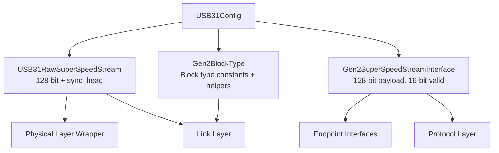
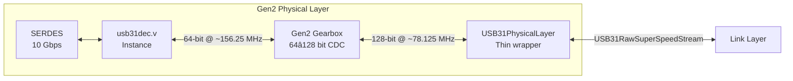
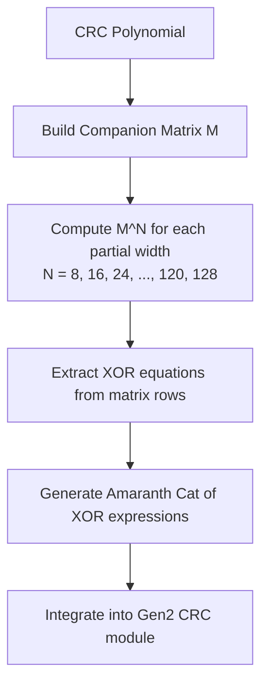
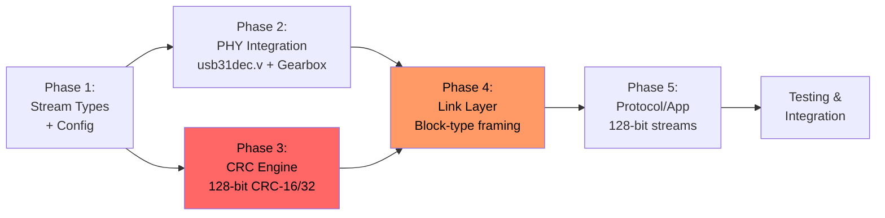

# LUNA USB 3.1 Gen2 Wide Data Path Analysis: 128-bit Internal Architecture at 10 Gbps

## Table of Contents

1. [Problem Statement](#1-problem-statement)
2. [Architecture Overview](#2-architecture-overview)
3. [Clock Frequency Analysis](#3-clock-frequency-analysis)
4. [Encoding Model: 128b/132b](#4-encoding-model-128b132b)
5. [Stream Types](#5-stream-types)
6. [Complete File Impact Assessment](#6-complete-file-impact-assessment)
7. [Detailed Modification Plan](#7-detailed-modification-plan)
8. [Phase 1: Stream Infrastructure](#8-phase-1-stream-infrastructure)
9. [Phase 2: Physical Layer — usb31dec.v Integration](#9-phase-2-physical-layer--usb31decv-integration)
10. [Phase 3: CRC Engine](#10-phase-3-crc-engine)
11. [Phase 4: Link Layer](#11-phase-4-link-layer)
12. [Phase 5: Protocol & Application](#12-phase-5-protocol--application)
13. [Key Architectural Challenges](#13-key-architectural-challenges)
14. [Chosen Data Width: 128-bit](#14-chosen-data-width-128-bit)
15. [Alternative Approaches](#15-alternative-approaches)
16. [Companion Document: PHY Integration](#16-companion-document-phy-integration)

---

## 1. Problem Statement

### Why a 128-bit Internal Data Path Is Required

USB 3.0 SuperSpeed operates at 5 Gbps line rate with 8b/10b encoding (20% overhead), yielding 4 Gbps effective throughput. LUNA's existing Gen1 implementation uses a **32-bit (4-symbol) data path clocked at 125 MHz**:

```
32 bits × 125 MHz = 4,000 Mbps = 4 Gbps effective throughput ✓
```

USB 3.1 Gen2 (SuperSpeed+ 10 Gbps) doubles the line rate to 10 Gbps and switches from 8b/10b to **128b/132b encoding**, reducing overhead to ~3%. The effective data rate becomes approximately 9.7 Gbps. Maintaining a narrow data path would require impractical clock frequencies:

| Data Width | Clock @ 10 Gbps | Feasibility |
|-----------|-----------------|-------------|
| 32-bit | 312.5 MHz | ❌ Impossible on all FPGA fabric |
| 64-bit | 156.25 MHz | ⚠️ Tight on mid-range FPGAs |
| **128-bit** | **78.125 MHz** | **✅ Comfortable on all FPGAs** |

### The Solution: 128-bit Data Path with usb31dec.v PHY

LUNA's Gen2 architecture uses a **128-bit (16-symbol) internal data path** clocked at **~78.125 MHz**. The physical layer is provided by the `usb31dec.v` Verilog module, which handles all Gen2 PHY processing and exposes a **64-bit Gen2 PIPE interface** at ~156.25 MHz. A simple **2:1 gearbox** converts this to LUNA's 128-bit internal domain.

```
usb31dec.v ──[64-bit @ ~156.25 MHz]──► Gearbox ──[128-bit @ ~78.125 MHz]──► LUNA Stack
```

---

## 2. Architecture Overview

### Data Flow Overview

```mermaid
graph LR
    subgraph Physical Layer
        PHY[usb31dec.v Instance<br/>64-bit Gen2 PIPE<br/>@ ~156.25 MHz]
        GEAR[64→128 Gearbox<br/>CDC bridge]
    end

    subgraph Link Layer - 128-bit @ ~78.125 MHz
        CMD[Link Commands<br/>Block-type framing]
        ORD[Ordered Sets<br/>Gen2 format]
        HDR[Header Receiver<br/>Single-cycle capture]
        DPR[Data Packet Rx<br/>128-bit CRC]
        CRC16[CRC-16<br/>128-bit input]
        CRC32[CRC-32<br/>128-bit input]
        TX[Transmitter<br/>Block-type framing]
    end

    subgraph Protocol Layer - 128-bit @ ~78.125 MHz
        EP[Endpoint Mux]
        TXN[Transaction]
        LM[Link Mgmt]
    end

    subgraph Application - 128-bit @ ~78.125 MHz
        CTRL[Control EP]
        STRM[Stream EP]
        DESC[Descriptors]
    end

    PHY --> GEAR
    GEAR --> CMD
    GEAR --> ORD
    GEAR --> HDR --> DPR
    DPR --> EP --> CTRL
    EP --> STRM
    TX --> CRC16
    TX --> CRC32
```

### Key Architectural Difference: Gen2 vs Gen1

| Aspect | Gen1 — 5 Gbps | Gen2 — 10 Gbps |
|--------|---------------|----------------|
| Encoding | 8b/10b | 128b/132b |
| Framing | K-characters + ctrl bits | Sync headers + block types |
| Scrambling | 16-bit LFSR, 32-bit wide | 23-bit LFSR, 64-bit wide (in usb31dec.v) |
| Data symbols | SHP, SDP, SLC, EPF, END, etc. | Block type field in sync header |
| PHY data width | 32-bit with `datak` | 64-bit with `sync_head` |
| LUNA internal | 32-bit @ 125 MHz | **128-bit @ ~78.125 MHz** |
| PHY processing | LUNA modules (scrambler, CTC, alignment) | **usb31dec.v handles all** |

The `usb31dec.v` module handles all Gen2 physical-layer encoding internally — 128b/132b encode/decode, Gen2 scrambling/descrambling, block alignment, LFPS, and SERDES register management. LUNA receives **decoded, descrambled, block-aligned data** via the Gen2 PIPE interface. LUNA is responsible for everything from the link layer upward.

### PIPE Interface Architecture

```mermaid
graph TD
    subgraph Gen1 Path - Existing
        GEN1_PHY[SERDES PHY<br/>ECP5 / XC7 GTP / XC7 GTX]
        GEN1_PIPE[PIPEInterface<br/>width=1/2/4<br/>tx_data + tx_datak]
        GEN1_PHYS[USB3PhysicalLayer<br/>Scrambler, CTC, Alignment<br/>32-bit @ 125 MHz]
    end

    subgraph Gen2 Path - New
        GEN2_VERILOG[usb31dec.v Instance<br/>USB31DecPHYInstance]
        GEN2_PIPE[Gen2PIPEInterface<br/>64-bit<br/>tx_data + tx_sync_head]
        GEN2_GEARBOX[Gen2 Gearbox<br/>64→128 bit CDC]
        GEN2_PHYS[USB31PhysicalLayer<br/>Thin wrapper]
    end

    subgraph Common Stack - 128-bit @ ~78.125 MHz
        LINK[Link Layer]
        PROTO[Protocol Layer]
        APP[Application Layer]
    end

    GEN1_PHY --> GEN1_PIPE --> GEN1_PHYS
    GEN2_VERILOG --> GEN2_PIPE --> GEN2_GEARBOX --> GEN2_PHYS --> LINK
    LINK --> PROTO --> APP
```

---

## 3. Clock Frequency Analysis

### USB 3.1 Gen2 SuperSpeed+ (10 Gbps, 128b/132b)

| Parameter | Value |
|-----------|-------|
| Line rate | 10 Gbps |
| Encoding | 128b/132b (~3% overhead) |
| Effective data rate | ~9.7 Gbps |
| SERDES clock | 10 Gbps serial |
| PHY PIPE output | 64-bit @ ~156.25 MHz |
| After gearbox | **128-bit @ ~78.125 MHz** |

### Clock Domains

| Clock | Frequency | Source | Used By |
|-------|-----------|--------|---------|
| SERDES serial | 10 Gbps | SERDES PLL | Transceiver |
| `pclk` | ~156.25 MHz | usb31dec.v output | PIPE interface, gearbox input |
| **`ss`** | **~78.125 MHz** | pclk ÷ 2 (PLL) | **All LUNA internal logic** |
| `sync` | Platform default | Board PLL | CPU interface, configuration |

### Why ~78.125 MHz Is Ideal

The 128-bit data path at ~78.125 MHz provides:

- **12.8 ns timing budget** — generous for even complex combinational logic (CRC, block type detection, header parsing)
- **Comfortable on all target FPGAs** — Gowin, Lattice ECP5, Xilinx Artix-7, Kintex-7, UltraScale
- **Simple 2:1 gearbox** — the `usb31dec.v` PHY provides 64-bit, so only a straightforward 2:1 width conversion is needed
- **Natural header alignment** — a USB3 header packet (4 × 32 = 128 bits) fits in exactly 1 word

### Comparison with USB 3.0 Gen1

| Parameter | Gen1 (5 Gbps) | Gen2 (10 Gbps) |
|-----------|---------------|----------------|
| Encoding | 8b/10b (20% overhead) | 128b/132b (~3% overhead) |
| LUNA data width | 32-bit | **128-bit** |
| LUNA clock | 125 MHz | **~78.125 MHz** |
| PHY interface | 32-bit PIPE + datak | 64-bit Gen2 PIPE + sync_head |
| PHY processing | LUNA modules | usb31dec.v (Verilog Instance) |

---

## 4. Encoding Model: 128b/132b

### Gen2 Block Encoding (NOT 8b/10b)

USB 3.1 Gen2 uses **128b/132b block encoding**, which is fundamentally different from Gen1's 8b/10b encoding. There are **no K-characters** and **no per-byte ctrl bits** in Gen2.

#### 128b/132b Block Structure

Each block is 132 bits: a **4-bit sync header** followed by a **128-bit payload**:

```
┌──────────┬────────────────────────────────────────────────────┐
│ Sync Hdr │                  Block Payload                     │
│  4 bits  │                   128 bits                         │
├──────────┼────────────────────────────────────────────────────┤
│   0x3    │ [127:0] = Data payload                            │
│  (data)  │                                                    │
├──────────┼────────────────────────────────────────────────────┤
│   0xC    │ [7:0] = Block type                                │
│ (control)│ [127:8] = Type-specific content                   │
└──────────┴────────────────────────────────────────────────────┘
```

#### Sync Headers

| Sync Header | Value | Meaning |
|-------------|-------|---------|
| Data block | `0x3` (0b0011) | Raw data payload — no framing information |
| Control block | `0xC` (0b1100) | Contains block type field for framing |

#### Block Types (in control blocks, bits [7:0])

| Block Type | Value | Gen1 Equivalent | Content |
|-----------|-------|-----------------|---------|
| Header Start | `0x33` | SHP SHP SHP EPF | Marks start of header packet |
| Data Start | `0x66` | SDP SDP SDP EPF | Marks start of data packet payload |
| End Good | `0x78` | END END END EPF | Good end of packet |
| End Bad | `0x87` | EDB EDB EDB EPF | Bad end of packet / abort |
| Link Command | `0x4B` | SLC SLC SLC EPF | Link command block |
| Ordered Set | `0x1E` | COM-based patterns | Training sequences |

#### What usb31dec.v Handles

The `usb31dec.v` module performs all encoding/decoding internally:
- 128b/132b block encoding and decoding
- Gen2 scrambling with 23-bit LFSR (64-bit wide)
- RX/TX gearboxing between 64-bit and 66-bit blocks
- Block alignment
- DC balance for training sequences

**LUNA sees decoded 64-bit blocks with sync headers** on the Gen2 PIPE interface. After the gearbox, LUNA sees 128-bit blocks with sync headers. There is no need for LUNA to perform any encoding, decoding, scrambling, or alignment.

#### PIPE Interface Delivery

The 132-bit block is delivered over the 64-bit PIPE interface in two cycles:

```
Cycle 1 (start_block=1): sync_head[3:0], data[63:0]   (low half)
Cycle 2 (start_block=0): sync_head[3:0], data[63:0]   (high half)
```

After the gearbox, LUNA sees one combined word per `ss` clock cycle:

```
One ss cycle: data[127:0], sync_head[7:0], start_block[1:0]
```

---

## 5. Stream Types

### New Gen2 Stream: `USB31RawSuperSpeedStream`

The existing [`USBRawSuperSpeedStream`](gateware/usb/stream.py:261) uses `data[31:0]` + `ctrl[3:0]` fields designed for Gen1 8b/10b K-character framing. Gen2 requires a fundamentally different stream type with **sync headers** instead of ctrl bits.

#### `USB31RawSuperSpeedStream` Definition

| Field | Width | Description |
|-------|-------|-------------|
| `data` | 128 bits | Payload — two 64-bit halves of a 128b/132b block |
| `sync_head` | 8 bits | Sync header — 4 bits per 64-bit half (0x3=data, 0xC=control) |
| `start_block` | 2 bits | Block start markers — 1 per 64-bit half |
| `valid` | 1 bit | Stream valid |
| `ready` | 1 bit | Backpressure |

#### Comparison: Gen1 vs Gen2 Stream Types

| Feature | `USBRawSuperSpeedStream` (Gen1) | `USB31RawSuperSpeedStream` (Gen2) |
|---------|--------------------------------|-----------------------------------|
| Data width | 32-bit (4 bytes) | **128-bit (16 bytes)** |
| Control field | `ctrl` — 4-bit, 1 per byte | `sync_head` — 8-bit, 4 per half |
| Block markers | N/A | `start_block` — 2-bit |
| Framing detection | K-char pattern matching | **Sync header + block type** |
| Clock frequency | 125 MHz | **~78.125 MHz** |
| Throughput | 4 Gbps effective | **~10 Gbps effective** |

#### Gen2 Application-Layer Stream

The application-layer equivalent is `Gen2SuperSpeedStreamInterface`:

```python
class Gen2SuperSpeedStreamInterface(StreamInterface):
    def __init__(self):
        super().__init__(payload_width=128, valid_width=16)
```

This replaces the Gen1 [`SuperSpeedStreamInterface`](gateware/usb/stream.py:329) which is hardcoded at `payload_width=32, valid_width=4`.

---

## 6. Complete File Impact Assessment

### Difficulty Legend

| Rating | Meaning |
|--------|---------|
| 🔴 **Critical** | Requires fundamental algorithmic redesign; hand-derived equations or exponential complexity |
| 🟠 **Hard** | Extensive hardcoded constants, FSM restructuring, multi-cycle timing changes |
| 🟡 **Medium** | Moderate hardcoded values, pattern matching changes, parameterization needed |
| 🟢 **Easy** | Simple parameter propagation, constant updates, or already parameterized |
| ⚪ **None** | Width-independent; no changes needed |
| 🔵 **Replaced** | Entire module replaced by usb31dec.v; no modification needed |

### Physical Layer — REPLACED by usb31dec.v

The entire `gateware/usb/usb3/physical/` directory is **replaced** by the `usb31dec.v` Verilog Instance for Gen2 operation. These modules handle Gen1 physical-layer processing (8b/10b encoding, scrambling, CTC skip handling, word alignment) which is all performed internally by `usb31dec.v` for Gen2.

| File | Status | Reason |
|------|--------|--------|
| [`gateware/usb/usb3/physical/scrambling.py`](gateware/usb/usb3/physical/scrambling.py) — `ScramblerLFSR`, `Scrambler`, `Descrambler` | 🔵 Replaced | usb31dec.v has Gen2 23-bit LFSR, 64-bit wide scrambler/descrambler |
| [`gateware/usb/usb3/physical/alignment.py`](gateware/usb/usb3/physical/alignment.py) — `RxWordAligner`, `RxPacketAligner` | 🔵 Replaced | usb31dec.v performs block alignment internally |
| [`gateware/usb/usb3/physical/ctc.py`](gateware/usb/usb3/physical/ctc.py) — `CTCSkipRemover`, `CTCSkipInserter` | 🔵 Replaced | Gen2 has no CTC SKP ordered sets; usb31dec.v handles elastic buffering |
| [`gateware/usb/usb3/physical/coding.py`](gateware/usb/usb3/physical/coding.py) | 🔵 Replaced | Gen1 8b/10b symbol definitions; Gen2 uses block types instead |
| [`gateware/usb/usb3/physical/layer.py`](gateware/usb/usb3/physical/layer.py) | 🔵 Replaced | Gen1 physical layer wiring; replaced by `USB31PhysicalLayer` |
| [`gateware/usb/usb3/physical/lfps.py`](gateware/usb/usb3/physical/lfps.py) | 🔵 Replaced | usb31dec.v handles LFPS generation/detection internally |
| [`gateware/usb/usb3/physical/power.py`](gateware/usb/usb3/physical/power.py) | 🔵 Replaced | usb31dec.v manages PIPE power states P0-P3 and RX detect internally |

**New modules for Gen2 physical layer:**

| New File | Purpose |
|----------|---------|
| `gateware/interface/usb31dec_phy.py` | `USB31DecPHYInstance` — Amaranth Instance wrapper for usb31dec.v |
| `gateware/interface/gen2_pipe.py` | `Gen2PIPEInterface` — 64-bit PIPE with sync headers |
| `gateware/interface/gen2_gearbox.py` | `Gen2RxGearbox`, `Gen2TxGearbox` — 64↔128 bit CDC |
| `gateware/usb/usb3/physical/gen2_layer.py` | `USB31PhysicalLayer` — thin wrapper combining Instance + Gearbox |
| `gateware/usb/usb3/physical/gen2_coding.py` | `Gen2BlockType` — block type constants and helpers |

### PIPE Interface

| File | Difficulty | Key Issues |
|------|-----------|------------|
| [`gateware/interface/pipe.py`](gateware/interface/pipe.py) — `PIPEInterface` | ⚪ None | Gen1 interface retained as-is; Gen2 uses separate `Gen2PIPEInterface` |
| [`gateware/interface/pipe.py`](gateware/interface/pipe.py) — `AsyncPIPEInterface` | ⚪ None | Gen1 only; not used in Gen2 path |
| [`gateware/interface/pipe.py`](gateware/interface/pipe.py) — `GearedPIPEInterface` | ⚪ None | Gen1 only; Gen2 gearing handled by `Gen2Gearbox` |

### Link Layer

| File | Difficulty | Key Issues |
|------|-----------|------------|
| [`gateware/usb/usb3/link/crc.py`](gateware/usb/usb3/link/crc.py) — `HeaderPacketCRC` | 🔴 Critical | Hand-expanded CRC-16 for 32-bit input at [lines 96-129](gateware/usb/usb3/link/crc.py:96); needs 128-bit input variant for Gen2 |
| [`gateware/usb/usb3/link/crc.py`](gateware/usb/usb3/link/crc.py) — `DataPacketPayloadCRC` | 🔴 Critical | Hand-expanded CRC-32 for 32-bit at [lines 223-256](gateware/usb/usb3/link/crc.py:223); needs 128-bit input + 15 partial-width variants |
| [`gateware/usb/usb3/link/command.py`](gateware/usb/usb3/link/command.py) — `LinkCommandDetector` | 🟠 Hard | 2-state FSM matches K-char pattern; Gen2 uses single-cycle block-type detection on 128-bit word |
| [`gateware/usb/usb3/link/command.py`](gateware/usb/usb3/link/command.py) — `LinkCommandGenerator` | 🟠 Hard | 2-cycle K-char emission; Gen2 emits single control block in one 128-bit cycle |
| [`gateware/usb/usb3/link/data.py`](gateware/usb/usb3/link/data.py) — `DataPacketReceiver` | 🟠 Hard | 4-bit valid logic at [lines 229-232](gateware/usb/usb3/link/data.py:229); needs 16-bit valid for 128-bit words, block-type framing instead of K-chars |
| [`gateware/usb/usb3/link/data.py`](gateware/usb/usb3/link/data.py) — `DataPacketTransmitter` | 🟡 Medium | Uses `SuperSpeedStreamInterface` (32-bit); needs 128-bit `Gen2SuperSpeedStreamInterface` |
| [`gateware/usb/usb3/link/ordered_sets.py`](gateware/usb/usb3/link/ordered_sets.py) | 🟠 Hard | Training set constants are 32-bit entries with K-char patterns; Gen2 uses control blocks with block_type=0x1E, entire ordered set in one 128-bit word |
| [`gateware/usb/usb3/link/receiver.py`](gateware/usb/usb3/link/receiver.py) | 🟠 Hard | Multi-cycle FSM receives DW0-DW3 one per cycle; at 128-bit, entire header arrives in 1 cycle (2-cycle FSM: detect HP_START block, then capture 128-bit data block) |
| [`gateware/usb/usb3/link/transmitter.py`](gateware/usb/usb3/link/transmitter.py) | 🟠 Hard | CRC insertion, K-char framing, partial-word handling all hardcoded to 32-bit; needs block-type framing for 128-bit |
| [`gateware/usb/usb3/link/idle.py`](gateware/usb/usb3/link/idle.py) | 🟢 Easy | `RX_CYCLES_REQUIRED=4` at [line 38](gateware/usb/usb3/link/idle.py:38) (16B / 4B per cycle); at 128-bit: `RX_CYCLES_REQUIRED=1` (16B / 16B per cycle) |
| [`gateware/usb/usb3/link/timers.py`](gateware/usb/usb3/link/timers.py) | 🟢 Easy | Already parameterized by `ss_clock_frequency`; update to ~78.125 MHz |
| [`gateware/usb/usb3/link/ltssm.py`](gateware/usb/usb3/link/ltssm.py) | 🟡 Medium | Pure control FSM; needs Gen2 speed negotiation states and `ss_clock_frequency` update to ~78.125 MHz |
| [`gateware/usb/usb3/link/header.py`](gateware/usb/usb3/link/header.py) | 🟢 Easy | Record definitions; width-independent |
| [`gateware/usb/usb3/link/layer.py`](gateware/usb/usb3/link/layer.py) | 🟡 Medium | Wiring layer; needs new `USB31LinkLayer` for Gen2 block-type components |

### Protocol Layer

| File | Difficulty | Key Issues |
|------|-----------|------------|
| [`gateware/usb/usb3/protocol/layer.py`](gateware/usb/usb3/protocol/layer.py) | 🟢 Easy | Wiring; needs parameter propagation for 128-bit streams |
| [`gateware/usb/usb3/protocol/endpoint.py`](gateware/usb/usb3/protocol/endpoint.py) | 🟡 Medium | Creates `SuperSpeedStreamInterface` (hardcoded 32-bit); needs 128-bit `Gen2SuperSpeedStreamInterface` |
| [`gateware/usb/usb3/protocol/transaction.py`](gateware/usb/usb3/protocol/transaction.py) | ⚪ None | Operates on `HeaderPacket` records; width-independent |
| [`gateware/usb/usb3/protocol/data.py`](gateware/usb/usb3/protocol/data.py) | ⚪ None | Header packets only; width-independent |
| [`gateware/usb/usb3/protocol/link_management.py`](gateware/usb/usb3/protocol/link_management.py) | 🟢 Easy | Width-independent; needs `LINK_SPEED_10GBPS` constant |
| [`gateware/usb/usb3/protocol/timestamp.py`](gateware/usb/usb3/protocol/timestamp.py) | ⚪ None | Width-independent |

### Application & Endpoint Layer

| File | Difficulty | Key Issues |
|------|-----------|------------|
| [`gateware/usb/usb3/endpoints/stream.py`](gateware/usb/usb3/endpoints/stream.py) — `SuperSpeedStreamInEndpoint` | 🟠 Hard | Hardcoded `+4` at [line 157](gateware/usb/usb3/endpoints/stream.py:157), 4-bit valid patterns at [lines 165-172](gateware/usb/usb3/endpoints/stream.py:165), shift-by-2 at [lines 185-187](gateware/usb/usb3/endpoints/stream.py:185); needs 128-bit: `+16`, 16-bit valid patterns, shift-by-4 |
| [`gateware/usb/usb3/endpoints/control.py`](gateware/usb/usb3/endpoints/control.py) | 🟡 Medium | Width-dependent via interfaces only |
| [`gateware/usb/usb3/application/request.py`](gateware/usb/usb3/application/request.py) — `SuperSpeedSetupDecoder` | 🟡 Medium | Assumes SETUP arrives as 2×32-bit words at [lines 159-170](gateware/usb/usb3/application/request.py:159); at 128-bit, entire 8-byte SETUP arrives in lower 64 bits of one word |
| [`gateware/usb/usb3/application/descriptor.py`](gateware/usb/usb3/application/descriptor.py) | 🟢 Easy | Uses `SuperSpeedStreamInterface`; delegates to `ConstantStreamGenerator` which is already width-aware |
| [`gateware/usb/usb3/request/standard.py`](gateware/usb/usb3/request/standard.py) | 🟡 Medium | Hardcoded 4-bit valid table at [line 81](gateware/usb/usb3/request/standard.py:81) and `Signal(4)` at [line 84](gateware/usb/usb3/request/standard.py:84); needs 16-bit valid table and `Signal(16)` |

### Device & Stream Infrastructure

| File | Difficulty | Key Issues |
|------|-----------|------------|
| [`gateware/usb/stream.py`](gateware/usb/stream.py) — `USBRawSuperSpeedStream` | 🟡 Medium | Gen1 stream retained; new `USB31RawSuperSpeedStream` created for Gen2 |
| [`gateware/usb/stream.py`](gateware/usb/stream.py) — `SuperSpeedStreamInterface` | 🟡 Medium | Gen1 interface retained; new `Gen2SuperSpeedStreamInterface` created |
| [`gateware/usb/usb3/device.py`](gateware/usb/usb3/device.py) | 🟡 Medium | New `USB31SuperSpeedDevice` for Gen2; Gen1 `USBSuperSpeedDevice` retained |
| [`gateware/interface/serdes_phy/`](gateware/interface/serdes_phy/) | ⚪ None | Gen1 SERDES PHY files unchanged; Gen2 uses usb31dec.v instead |

---

## 7. Detailed Modification Plan

### Module-by-Module Changes

#### New: `USB31RawSuperSpeedStream`

**Purpose**: Replace `USBRawSuperSpeedStream` for Gen2 data path.

```python
class USB31RawSuperSpeedStream(StreamInterface):
    """Stream for USB 3.1 Gen2 128b/132b block-encoded data."""

    SYNC_DATA    = 0x3
    SYNC_CONTROL = 0xC

    BLOCK_TYPE_ORDERED_SET  = 0x1E
    BLOCK_TYPE_HP_START     = 0x33
    BLOCK_TYPE_DP_START     = 0x66
    BLOCK_TYPE_END_GOOD     = 0x78
    BLOCK_TYPE_END_BAD      = 0x87
    BLOCK_TYPE_LINK_CMD     = 0x4B

    def __init__(self):
        super().__init__(
            payload_width=128,
            extra_fields=[
                ('sync_head',    8),   # 4 bits per 64-bit half
                ('start_block',  2),   # 1 per 64-bit half
            ]
        )
```

#### New: `Gen2SuperSpeedStreamInterface`

**Purpose**: Replace `SuperSpeedStreamInterface` for Gen2 application layer.

```python
class Gen2SuperSpeedStreamInterface(StreamInterface):
    def __init__(self):
        super().__init__(payload_width=128, valid_width=16)
```

#### New: `Gen2BlockType` Coding Helpers

**Purpose**: Replace Gen1 K-character pattern matching with block-type detection.

```python
def stream_block_type_matches(stream, block_type):
    """Returns true when the stream carries a control block of the given type."""
    return (
        stream.valid &
        (stream.sync_head[0:4] == Gen2BlockType.SYNC_CONTROL) &
        (stream.data[0:8] == block_type)
    )
```

#### New: `Gen2LinkCommandDetector`

**Current Gen1**: 2-state FSM — wait for `SLC,SLC,SLC,EPF` K-char pattern, then parse 32-bit command word.
**Gen2 at 128-bit**: Single-cycle combinational detector. A link command is a control block with `block_type=0x4B`. The entire command fits in one 128-bit word.

```python
class Gen2LinkCommandDetector(Elaboratable):
    """Single-cycle link command detector for Gen2 128-bit data path."""

    def elaborate(self, platform):
        m = Module()
        is_link_cmd = stream_block_type_matches(
            self.sink, Gen2BlockType.LINK_CMD
        )
        # Command word is in bits [23:8] of the block
        cmd_word    = self.sink.data[8:24]
        cmd_replica = self.sink.data[24:40]
        with m.If(is_link_cmd & (cmd_word == cmd_replica)):
            m.d.comb += [
                self.new_command.eq(1),
                self.command.eq(cmd_word[0:3]),
                self.subtype.eq(cmd_word[3:7]),
            ]
        return m
```

#### New: `Gen2LinkCommandGenerator`

**Current Gen1**: 2-cycle output (K-char header + command word).
**Gen2 at 128-bit**: Single-cycle output — emit one control block with `block_type=0x4B`.

#### Modified: `DataPacketReceiver` → `Gen2DataPacketReceiver`

**Current Gen1**: Receives header words DW0-DW3 one per cycle (4 cycles for 128 bits of header). Uses K-char framing.
**Gen2 at 128-bit**: Header start is a control block (`block_type=HP_START`), followed by a data block containing all 4 DWs in one 128-bit word. The FSM collapses to 2 cycles.

The valid-bit logic at [lines 229-232](gateware/usb/usb3/link/data.py:229) must be generalized for 16 bytes per word:

```python
# Gen2: 16 bytes per word
for i in range(16):
    m.d.comb += source.valid[i].eq((data_bytes_remaining > i) & sink.valid)
```

#### Modified: `SuperSpeedStreamInEndpoint`

**Current Gen1**: Hardcoded for 4-byte words throughout.
**Gen2 at 128-bit**: All constants derived from `bytes_per_word=16`:
- `write_fill_count + 4` → `write_fill_count + 16`
- `>> 2` → `>> 4`
- `[0:2]` → `[0:4]`
- Valid bit patterns generated programmatically for 16 bits

```python
# Generate valid patterns for 16 bytes per word
for count in range(1, 17):
    pattern = (1 << count) - 1
    with m.Case(pattern):
        m.d.ss += write_fill_count.eq(write_fill_count + count)
```

#### Modified: `SuperSpeedSetupDecoder`

**Current Gen1**: Parses SETUP as 2×32-bit words across 2 cycles.
**Gen2 at 128-bit**: Entire 8-byte SETUP packet arrives in the lower 64 bits of one 128-bit word. The FSM simplifies to single-cycle capture.

---

## 8. Phase 1: Stream Infrastructure

### Goal
Define the Gen2 stream types and coding helpers that flow through the entire 128-bit design.

### Changes Required

1. **New `USB31RawSuperSpeedStream`**: 128-bit data + 8-bit sync_head + 2-bit start_block
2. **New `Gen2SuperSpeedStreamInterface`**: 128-bit payload, 16-bit valid
3. **New `Gen2BlockType` coding helpers**: Block type constants and detection functions
4. **New configuration**: `USB31Config` with `data_width=128`, `ss_clock_frequency=78.125e6`

### Proposed Configuration

```python
# In a new file: gateware/usb/usb3/config31.py
class USB31Config:
    def __init__(self):
        self.data_width = 128
        self.symbols_per_word = 16
        self.bytes_per_word = 16
        self.ss_clock_frequency = 78.125e6
        self.phy_clock_frequency = 156.25e6
        self.line_rate = 10e9
        self.encoding = '128b/132b'
```

### Dependency Graph



---

## 9. Phase 2: Physical Layer — usb31dec.v Integration

### Architecture

The Gen2 physical layer is fundamentally different from Gen1. Instead of LUNA modules performing scrambling, alignment, and CTC handling, the `usb31dec.v` Verilog Instance handles all physical-layer processing. LUNA only needs:

1. **`USB31DecPHYInstance`** — Amaranth Instance wrapper for usb31dec.v
2. **`Gen2PIPEInterface`** — 64-bit PIPE interface with sync headers (not datak)
3. **`Gen2Gearbox`** — 64-to-128 bit width conversion with pclk→ss CDC
4. **`USB31PhysicalLayer`** — Thin wrapper combining the above



### What usb31dec.v Replaces

The following LUNA modules are **entirely replaced** by usb31dec.v for Gen2 and do **not** need modification:

| Replaced Module | What It Did | Why Redundant |
|----------------|-------------|---------------|
| `ScramblerLFSR` / `Scrambler` / `Descrambler` | Gen1 16-bit LFSR, 32-bit wide | usb31dec.v has Gen2 23-bit LFSR, 64-bit wide |
| `RxWordAligner` / `RxPacketAligner` | K-char boundary alignment | usb31dec.v does 128b/132b block alignment |
| `CTCSkipRemover` / `CTCSkipInserter` | SKP ordered set handling | Gen2 has no CTC SKP; usb31dec.v handles elastic buffering |
| `PHYResetController` / `LinkPartnerDetector` | PIPE power state, RX detect | usb31dec.v manages P0-P3 and RX detect via SERDES CSR |
| `LFPSTransceiver` | LFPS generation/detection | usb31dec.v handles LFPS internally |

### Gen2 Gearbox

The gearbox is the critical bridge between the PHY's 64-bit@~156.25 MHz and LUNA's 128-bit@~78.125 MHz:

**RX path**: Accumulates two consecutive 64-bit words into one 128-bit word, with async FIFO for CDC.

**TX path**: Splits one 128-bit word into two consecutive 64-bit words, with async FIFO for CDC.

```
pclk:  ─A0──A1──B0──B1──C0──C1──D0──D1─  (64-bit @ ~156.25 MHz)
ss:    ────A────────B────────C────────D─  (128-bit @ ~78.125 MHz)
```

See [companion document](usb31-phy-integration.md) for complete gearbox implementation details.

---

## 10. Phase 3: CRC Engine

### The Gating Item

The CRC modules are the **single largest engineering effort** in this project. They contain hand-expanded polynomial equations that are structurally tied to specific input widths. For 128-bit Gen2 operation, entirely new equation sets must be generated.

### Current State (Gen1, 32-bit)

#### [`HeaderPacketCRC`](gateware/usb/usb3/link/crc.py:45) (CRC-16)

- Polynomial: USB CRC-16
- Input width: 32 bits (fixed)
- [`_generate_next_crc()`](gateware/usb/usb3/link/crc.py:82) at [lines 96-129](gateware/usb/usb3/link/crc.py:96): 16 output bits, each a XOR of specific data and state bits

#### [`DataPacketPayloadCRC`](gateware/usb/usb3/link/crc.py:154) (CRC-32)

- Polynomial: USB CRC-32
- Full-word variant: 32-bit input at [lines 223-256](gateware/usb/usb3/link/crc.py:223)
- Partial variants: 24-bit at [lines 267-300](gateware/usb/usb3/link/crc.py:267), 16-bit at [lines 311-344](gateware/usb/usb3/link/crc.py:311), 8-bit at [lines 354-387](gateware/usb/usb3/link/crc.py:354)

### What Gen2 128-bit Needs

#### CRC-16 for Header Packets

At 128-bit width, the entire header (4 × 32-bit DWs = 128 bits) arrives in a single cycle. The CRC-16 must process **128 bits of input** in one clock cycle.

| Input Width | Equations per Set | Sets Needed |
|------------|------------------|-------------|
| 32-bit (Gen1) | 16 | 1 |
| **128-bit (Gen2)** | **16** | **1** |

#### CRC-32 for Data Packet Payloads

At 128-bit width, the CRC-32 must process 128 bits per cycle, plus handle partial words at packet boundaries. The required variants:

| Input Width | Full-Word Equations | Partial Variants | Total Equation Sets |
|------------|-------------------|-----------------|-------------------|
| 32-bit (Gen1) | 32 | 3 (24, 16, 8 bits) | 4 |
| **128-bit (Gen2)** | **32** | **15 (120, 112, 104, 96, 88, 80, 72, 64, 56, 48, 40, 32, 24, 16, 8 bits)** | **16** |

Each equation set contains 32 XOR equations (for CRC-32) or 16 XOR equations (for CRC-16), where each equation references specific bits from both the current CRC state and the input data.

**Total XOR equations for Gen2**: 16 × 32 = **512** (CRC-32) + 16 (CRC-16) = **528 equations**.

### Approach: Automated CRC Equation Generation

The hand-derived equations in the current code were likely generated by a tool. The approach for 128-bit CRCs:

1. **Write a CRC equation generator** using GF(2) linear algebra:
   - Represent the serial CRC as a state transition: `S' = M · S ⊕ D` where M is the companion matrix
   - For N-bit parallel input, compute `M^N` (matrix power over GF(2))
   - The resulting matrix directly gives the XOR equations

2. **Generate equations at elaboration time**:

```python
class ParameterizedCRC(Elaboratable):
    def __init__(self, polynomial, crc_width, data_width):
        self.polynomial = polynomial
        self.crc_width = crc_width
        self.data_width = data_width

    def _generate_equations(self, crc_bits, data_bits, width):
        """Symbolically compute CRC equations for given input width."""
        # Use GF(2) matrix multiplication approach
        ...

    def elaborate(self, platform):
        m = Module()
        for partial_width in range(8, self.data_width + 1, 8):
            equations = self._generate_equations(...)
        return m
```

3. **Validation**: Extend [`gateware/test/contrib/crc.py`](gateware/test/contrib/crc.py) to validate 128-bit CRC implementations against reference software CRC.

### CRC Generation Algorithm



This is a well-understood technique used by tools like `pycrc`, `crcmod`, and Xilinx's CRC IP generator.

---

## 11. Phase 4: Link Layer

### Fundamental Change: Block-Type Framing

The most significant link layer change is the shift from **K-character-based framing** (Gen1) to **block-type-based framing** (Gen2). This affects every module that detects or generates packet boundaries.

#### Gen1 Framing (Current)

```
Header Packet:  [SHP SHP SHP EPF] [DW0] [DW1] [DW2] [DW3]
                 ctrl=0b1111       ctrl=0       ...

Link Command:   [SLC SLC SLC EPF] [cmd_word]
                 ctrl=0b1111       ctrl=0
```

#### Gen2 Framing (New, 128-bit)

```
Header Packet:  [sync=0xC, block_type=0x33, ...] [sync=0x3, DW0|DW1|DW2|DW3]
                 Control block: HP_START           Data block: 128-bit header

Link Command:   [sync=0xC, block_type=0x4B, cmd_word, cmd_replica, padding]
                 Control block: entire command in one 128-bit word

Data Packet:    [sync=0xC, block_type=0x66, ...] [sync=0x3, payload]... [sync=0xC, block_type=0x78]
                 DP_START control block            Data blocks           END_GOOD control block
```

### Link Commands

#### `Gen2LinkCommandDetector`

**Gen1**: 2-state FSM — wait for K-char LCSTART, then parse 32-bit command word.
**Gen2 at 128-bit**: Single-cycle combinational detector. Check `sync_head` for control block, check `block_type` for `0x4B`, extract command from bits [23:8].

#### `Gen2LinkCommandGenerator`

**Gen1**: 2-cycle output (K-char header + command word).
**Gen2 at 128-bit**: Single-cycle output — emit one control block with `block_type=0x4B`, command word in bits [23:8], replica in bits [39:24].

### Ordered Sets

#### Gen2 Training Sequences

Gen2 ordered sets are encoded as control blocks with `block_type=0x1E`. The training sequence data occupies bits [127:8] of the block. At 128-bit width, an entire ordered set block arrives in **one cycle**.

**Gen1**: Training set constants stored as arrays of 32-bit words; multi-state FSM with one state per word.
**Gen2**: Each training sequence is a single 128-bit control block; single-cycle detection.

### Header Packet Reception

| Data Width | Cycles for Header | States Needed |
|-----------|-------------------|---------------|
| 32-bit (Gen1) | 5+ (framing + 4 DWs) | WAIT, DW0, DW1, DW2, DW3, CHECK |
| **128-bit (Gen2)** | **2** | **WAIT_FOR_HP_START, RECEIVE_HEADER** |

At 128-bit, the entire 128-bit header (DW0-DW3) arrives in a single data block following the HP_START control block. All header parsing is combinational within that single cycle.

### Data Packet Handling

#### `Gen2DataPacketReceiver`

**Payload reception** — the valid-bit logic must handle 16 bytes per word:

```python
# Gen2: 16 bytes per word
for i in range(16):
    m.d.comb += source.valid[i].eq((data_bytes_remaining > i) & sink.valid)
```

**CRC advance** — currently has 4 cases (full word, 3B, 2B, 1B). For 128-bit, need 16 cases (full word, 15B, 14B, ..., 1B).

**Framing detection** — uses `sync_head` + `block_type` instead of K-char patterns. Data packet start is `block_type=0x66`, end is `block_type=0x78` (good) or `0x87` (bad).

### Header Receiver and Transmitter

The [`receiver.py`](gateware/usb/usb3/link/receiver.py) and [`transmitter.py`](gateware/usb/usb3/link/transmitter.py) need Gen2 equivalents:

**Gen2 Receiver**: 2-cycle FSM (detect HP_START control block → capture 128-bit data block). All 4 DWs parsed combinationally in one cycle.

**Gen2 Transmitter**: Emits control blocks for framing (HP_START, DP_START, END_GOOD) and data blocks for payload. CRC-16 for headers and CRC-32 for data computed over 128-bit words. Block-type framing replaces K-char insertion.

### Idle Handler

[`IdleHandshakeHandler`](gateware/usb/usb3/link/idle.py:12) at [line 38](gateware/usb/usb3/link/idle.py:38):

```python
# Gen1 (32-bit @ 125 MHz)
RX_CYCLES_REQUIRED = 4  # 16B / 4B per cycle

# Gen2 (128-bit @ ~78.125 MHz)
RX_CYCLES_REQUIRED = 1  # 16B / 16B per cycle
```

---

## 12. Phase 5: Protocol & Application

### Endpoint Stream Interface

#### `SuperSpeedStreamInEndpoint` → Gen2 Variant

This is the most width-dependent application-layer module. Key changes for 128-bit:

| Location | Gen1 (32-bit) | Gen2 (128-bit) |
|----------|--------------|----------------|
| [Line 157](gateware/usb/usb3/endpoints/stream.py:157) | `write_fill_count + 4` | `write_fill_count + 16` |
| [Lines 165-172](gateware/usb/usb3/endpoints/stream.py:165) | `0b0001, 0b0011, 0b0111, 0b1111` | Generated for 16 bits |
| [Lines 185-187](gateware/usb/usb3/endpoints/stream.py:185) | `>> 2` (÷4) | `>> 4` (÷16) |
| [Line 317](gateware/usb/usb3/endpoints/stream.py:317) | `<< 2` (×4) | `<< 4` (×16) |
| [Line 336](gateware/usb/usb3/endpoints/stream.py:336) | `[0:2]` (mod 4) | `[0:4]` (mod 16) |
| [Lines 339-353](gateware/usb/usb3/endpoints/stream.py:339) | 4 valid patterns | 16 valid patterns |

Valid-bit pattern generation for 16 bytes per word:

```python
for count in range(1, 17):
    pattern = (1 << count) - 1
    with m.Case(pattern):
        m.d.ss += write_fill_count.eq(write_fill_count + count)
```

### Setup Decoder

#### `SuperSpeedSetupDecoder` → Gen2 Variant

**Gen1**: 2-word FSM at [lines 153-170](gateware/usb/usb3/application/request.py:153).
**Gen2 at 128-bit**: SETUP packet is exactly 8 bytes, which fits in the lower 64 bits of one 128-bit word. Single-cycle capture:

```python
with m.State("WAIT_FOR_SETUP"):
    packet_starting = self.sink.valid.all() & self.sink.first & self.sink.last
    packet_is_setup = self.header_in.setup

    with m.If(packet_starting & packet_is_setup):
        m.d.ss += packet.eq(self.sink.data[0:64])  # Lower 64 bits
        m.next = "WAIT_FOR_VALID"
```

### Standard Request Handler

#### `StandardRequestHandler` → Gen2 Variant

The `valid_bits_for_length` table at [line 81](gateware/usb/usb3/request/standard.py:81) and `Signal(4)` at [line 84](gateware/usb/usb3/request/standard.py:84) need 128-bit equivalents:

```python
# Gen1
valid_bits_for_length = [0b0000, 0b0001, 0b0011, 0b0111, 0b1111]
tx_valid = Signal(4)

# Gen2 (128-bit)
valid_bits_for_length = [(1 << i) - 1 for i in range(17)]  # 0 through 16
tx_valid = Signal(16)
```

---

## 13. Key Architectural Challenges

### Challenge 1: Block-Type Framing (Gen2-Specific)

Gen2 uses 128b/132b block-type framing instead of Gen1's K-character framing. This is a fundamental protocol change, not just a width change:

- **No K-characters**: The `ctrl` bits and K-character pattern matching used throughout the Gen1 link layer do not exist in Gen2
- **Sync headers**: Every 128-bit block has a 4-bit sync header identifying it as data (0x3) or control (0xC)
- **Block types**: Control blocks contain an 8-bit block type field that identifies the framing event (HP_START, DP_START, END_GOOD, LINK_CMD, etc.)

**Impact**: All framing detection and generation code must be rewritten for block-type semantics. This is not a parameterization exercise — it requires new Gen2-specific modules.

### Challenge 2: Header Packet Alignment

USB3 header packets are exactly 128 bits (4 × 32-bit DWs). At 128-bit width:

| Width | Words per Header | Alignment |
|-------|-----------------|-----------|
| 32-bit (Gen1) | 4 words | 1 DW per word |
| **128-bit (Gen2)** | **1 word** | **Entire header in 1 word** |

At 128-bit, the entire header arrives in a single cycle. This **simplifies** reception (no multi-cycle FSM for DW capture) but means all header parsing must be combinational rather than sequential. The 78.125 MHz clock provides ample timing margin for this combinational logic.

### Challenge 3: Partial-Word Tracking

Data packets can have payloads not aligned to 128-bit word boundaries. The valid mask must track which of the 16 bytes in a word are active:

| Width | Valid Bits | Possible Non-Zero Patterns |
|-------|-----------|---------------------------|
| 32-bit (Gen1) | 4 | 4 patterns |
| **128-bit (Gen2)** | **16** | **16 patterns** |

The CRC engine must support all 16 partial widths (128, 120, 112, ..., 16, 8 bits), and the transmitter must handle inserting CRC at any byte boundary within the 128-bit word.

### Challenge 4: Multi-Packet Words

At 128-bit width, a single word can potentially contain the **end of one packet and the start of another**. For example:

```
[... last bytes of data | CRC-32 | block_type=END_GOOD padding]
```

However, because Gen2 uses **block-based framing**, packet boundaries always align to block boundaries. Each 128-bit block is either a data block or a control block — there is no mixing within a single block. This means:

- A control block (HP_START, DP_START, END_GOOD, etc.) is always a complete framing event
- A data block always contains pure payload data
- **Multi-packet-within-one-block does not occur** in Gen2

This is a significant simplification compared to Gen1, where K-characters could appear at any byte position within a 32-bit word.

### Challenge 5: CRC Complexity at 128-bit

The CRC-32 engine needs 16 equation sets (128-bit full + 15 partial widths from 120 down to 8 bits). Each set contains 32 XOR equations. This is 512 equations total — large but manageable with automated generation.

The CRC-16 engine needs 1 equation set for 128-bit input (16 equations).

**Mitigation**: Use the GF(2) matrix approach to generate all equations programmatically at elaboration time, rather than hand-deriving them.

---

## 14. Chosen Data Width: 128-bit

### Why 128-bit Is the Right Choice

The 128-bit (16-symbol) internal data path at ~78.125 MHz is the **chosen architecture** for LUNA's Gen2 implementation. This is not a recommendation — it is the committed design decision.

### Rationale

1. **~78.125 MHz is comfortable for virtually all FPGAs**: Gowin, Lattice ECP5, Xilinx Artix-7 (any speed grade), Kintex-7, UltraScale — all can easily close timing at this frequency even for complex combinational logic like CRC computation and header parsing.

2. **Simple 2:1 gearbox**: The `usb31dec.v` PHY provides a 64-bit Gen2 PIPE interface at ~156.25 MHz. Converting to 128-bit@~78.125 MHz requires only a straightforward 2:1 gearbox with an async FIFO for CDC. No complex multi-stage gearing is needed.

3. **Natural header alignment**: A USB3 header packet is exactly 4 × 32 = 128 bits. At 128-bit width, the entire header fits in **exactly one word**, enabling single-cycle header capture and simplifying the receiver FSM dramatically.

4. **Block-type framing eliminates multi-packet words**: Gen2's 128b/132b encoding ensures packet boundaries align to block boundaries. Each 128-bit block is either data or control — no mixing. This eliminates the Gen1 problem of K-characters appearing at arbitrary positions within a word.

5. **Future-proof**: If even higher USB speeds emerge, the 128-bit infrastructure provides headroom. The ~78.125 MHz clock leaves substantial margin for additional logic complexity.

6. **Reduced FSM complexity**: Many Gen1 multi-cycle FSMs collapse to 1-2 cycles at 128-bit width:
   - Link commands: 2 cycles → 1 cycle
   - Header reception: 5+ cycles → 2 cycles
   - Ordered set detection: multi-cycle → 1 cycle
   - SETUP packet capture: 2 cycles → 1 cycle

### Clock and Throughput Summary

| Parameter | Value |
|-----------|-------|
| Internal data width | **128 bits (16 bytes)** |
| Internal clock | **~78.125 MHz** |
| Throughput | 128 × 78.125M = **10 Gbps** |
| PHY interface | 64-bit @ ~156.25 MHz |
| Gearbox ratio | 2:1 |
| SERDES line rate | 10 Gbps |

---

## 15. Alternative Approaches

### The Only Meaningful Alternative: 64-bit at ~156.25 MHz

The only alternative worth considering is using a **64-bit internal data path** at ~156.25 MHz instead of 128-bit at ~78.125 MHz. This would eliminate the gearbox entirely, since the `usb31dec.v` PHY already provides 64-bit output.

#### 64-bit vs 128-bit Comparison

| Factor | 64-bit @ ~156.25 MHz | 128-bit @ ~78.125 MHz |
|--------|----------------------|----------------------|
| Clock frequency | ~156.25 MHz | **~78.125 MHz** ✅ |
| FPGA compatibility | Tight on mid-range (Gowin, ECP5) | **All FPGAs** ✅ |
| Gearbox needed | None | Simple 2:1 |
| Header alignment | 2 words per header | **1 word per header** ✅ |
| CRC-32 partial variants | 8 (56 down to 8 bits) | 16 (120 down to 8 bits) |
| Link command cycles | 1 cycle | 1 cycle |
| Header Rx cycles | 3 (framing + 2 data) | **2 (framing + 1 data)** ✅ |
| Timing closure risk | Moderate | **Low** ✅ |
| Logic utilization | Lower | Higher (~1.5-2×) |
| Routing congestion | Lower | Higher |

#### Why We Chose 128-bit Over 64-bit

1. **FPGA compatibility**: ~156.25 MHz is marginal on Gowin FPGAs (the primary target for `usb31dec.v` integration) and tight on Lattice ECP5. At ~78.125 MHz, timing closure is virtually guaranteed on all targets.

2. **Header alignment**: At 64-bit, a 128-bit header spans 2 words, requiring a 2-cycle capture FSM. At 128-bit, the header fits in 1 word, enabling single-cycle capture. This simplifies the receiver significantly.

3. **Timing margin**: The 12.8 ns budget at ~78.125 MHz provides comfortable margin for CRC computation, block type detection, and header parsing — all of which must be combinational. At ~156.25 MHz (6.4 ns), these paths would be tight.

4. **Gearbox cost is minimal**: The 2:1 gearbox is a simple toggle-based accumulator with an async FIFO. It adds negligible latency (~2 cycles) and minimal resource usage.

---

## 16. Companion Document: PHY Integration

The detailed `usb31dec.v` integration plan — including the Amaranth Instance wrapper, Gen2 PIPE interface definition, gearbox implementation, SERDES platform abstraction, and implementation phases — is documented in the companion document:

**[USB 3.1 Gen2 PHY Integration Plan: usb31dec.v into LUNA](usb31-phy-integration.md)**

That document covers:
- Complete `USB31DecPHYInstance` Amaranth Instance code with all port mappings
- `Gen2PIPEInterface` class definition
- `Gen2RxGearbox` and `Gen2TxGearbox` implementation with timing diagrams
- `USB31PhysicalLayer` wrapper
- Gen2 link layer adaptation details (block-type framing, link commands, header/data packet handling)
- LTSSM Gen2 speed negotiation extensions
- SERDES platform abstraction (`SerDesInterface`, `GowinSerDesAdapter`)
- Modules made redundant by usb31dec.v
- 12-phase implementation plan with dependency graph
- Clock domain strategy and timing constraints
- File layout for all new modules

---

## Appendix A: File Reference Index

### New Files (Gen2)

| File Path | Key Classes | Purpose |
|-----------|------------|---------|
| `gateware/interface/usb31dec_phy.py` | `USB31DecPHYInstance` | Amaranth Instance wrapper for usb31dec.v |
| `gateware/interface/gen2_pipe.py` | `Gen2PIPEInterface` | 64-bit PIPE with sync headers |
| `gateware/interface/gen2_gearbox.py` | `Gen2RxGearbox`, `Gen2TxGearbox` | 64↔128 bit CDC gearbox |
| `gateware/interface/serdes_abstract.py` | `SerDesInterface` | Abstract SERDES interface |
| `gateware/interface/serdes_gowin.py` | `GowinSerDesAdapter` | Gowin SERDES mapping |
| `gateware/usb/usb3/stream31.py` | `USB31RawSuperSpeedStream` | 128-bit Gen2 stream type |
| `gateware/usb/usb3/config31.py` | `USB31Config` | Gen2 configuration |
| `gateware/usb/usb3/device31.py` | `USB31SuperSpeedDevice` | Gen2 device top-level |
| `gateware/usb/usb3/physical/gen2_coding.py` | `Gen2BlockType` | Block type constants + helpers |
| `gateware/usb/usb3/physical/gen2_layer.py` | `USB31PhysicalLayer` | Gen2 physical layer wrapper |
| `gateware/usb/usb3/link/gen2_command.py` | `Gen2LinkCommandDetector/Generator` | Single-cycle link commands |
| `gateware/usb/usb3/link/gen2_crc.py` | `Gen2HeaderPacketCRC`, `Gen2DataPacketPayloadCRC` | 128-bit CRC engines |
| `gateware/usb/usb3/link/gen2_data.py` | `Gen2DataPacketReceiver/Transmitter` | 128-bit data packet handling |
| `gateware/usb/usb3/link/gen2_layer.py` | `USB31LinkLayer` | Gen2 link layer wiring |
| `gateware/usb/usb3/link/gen2_ltssm.py` | `Gen2LTSSMController` | LTSSM with speed negotiation |
| `gateware/usb/usb3/link/gen2_ordered_sets.py` | `Gen2TSDetector/Emitter` | Gen2 training sequences |
| `gateware/usb/usb3/link/gen2_receiver.py` | `Gen2HeaderPacketReceiver` | 2-cycle header reception |
| `gateware/usb/usb3/link/gen2_transmitter.py` | `Gen2PacketTransmitter` | Block-type framing transmitter |

### Existing Files — Modification Required (Link, Protocol, Application Only)

| File Path | Key Classes | Difficulty |
|-----------|------------|-----------|
| [`gateware/usb/usb3/link/crc.py`](gateware/usb/usb3/link/crc.py) | `HeaderPacketCRC`, `DataPacketPayloadCRC` | 🔴🔴 |
| [`gateware/usb/usb3/link/command.py`](gateware/usb/usb3/link/command.py) | `LinkCommandDetector`, `LinkCommandGenerator` | 🟠🟠 |
| [`gateware/usb/usb3/link/data.py`](gateware/usb/usb3/link/data.py) | `DataPacketReceiver`, `DataPacketTransmitter` | 🟠🟡 |
| [`gateware/usb/usb3/link/ordered_sets.py`](gateware/usb/usb3/link/ordered_sets.py) | `TSBurstDetector`, `TSEmitter`, `TSTransceiver` | 🟠 |
| [`gateware/usb/usb3/link/receiver.py`](gateware/usb/usb3/link/receiver.py) | `HeaderPacketReceiver` | 🟠 |
| [`gateware/usb/usb3/link/transmitter.py`](gateware/usb/usb3/link/transmitter.py) | `HeaderPacketTransmitter` | 🟠 |
| [`gateware/usb/usb3/link/idle.py`](gateware/usb/usb3/link/idle.py) | `IdleHandshakeHandler` | 🟢 |
| [`gateware/usb/usb3/link/timers.py`](gateware/usb/usb3/link/timers.py) | Various timers | 🟢 |
| [`gateware/usb/usb3/link/ltssm.py`](gateware/usb/usb3/link/ltssm.py) | `LTSSMController` | 🟡 |
| [`gateware/usb/usb3/link/layer.py`](gateware/usb/usb3/link/layer.py) | `USB3LinkLayer` | 🟡 |
| [`gateware/usb/usb3/protocol/endpoint.py`](gateware/usb/usb3/protocol/endpoint.py) | `SuperSpeedEndpointMultiplexer` | 🟡 |
| [`gateware/usb/usb3/protocol/layer.py`](gateware/usb/usb3/protocol/layer.py) | `USB3ProtocolLayer` | 🟢 |
| [`gateware/usb/usb3/protocol/link_management.py`](gateware/usb/usb3/protocol/link_management.py) | `LinkManagementPacketHandler` | 🟢 |
| [`gateware/usb/usb3/endpoints/stream.py`](gateware/usb/usb3/endpoints/stream.py) | `SuperSpeedStreamInEndpoint` | 🟠 |
| [`gateware/usb/usb3/endpoints/control.py`](gateware/usb/usb3/endpoints/control.py) | `SuperSpeedControlEndpoint` | 🟡 |
| [`gateware/usb/usb3/application/request.py`](gateware/usb/usb3/application/request.py) | `SuperSpeedSetupDecoder` | 🟡 |
| [`gateware/usb/usb3/application/descriptor.py`](gateware/usb/usb3/application/descriptor.py) | `GetDescriptorHandler` | 🟢 |
| [`gateware/usb/usb3/request/standard.py`](gateware/usb/usb3/request/standard.py) | `StandardRequestHandler` | 🟡 |
| [`gateware/usb/usb3/device.py`](gateware/usb/usb3/device.py) | `USBSuperSpeedDevice` | 🟡 |

### Existing Files — No Modification Needed

| File Path | Key Classes | Why Unchanged |
|-----------|------------|--------------|
| [`gateware/usb/usb3/physical/*`](gateware/usb/usb3/physical/) | All Gen1 physical layer modules | 🔵 Replaced by usb31dec.v |
| [`gateware/interface/pipe.py`](gateware/interface/pipe.py) | `PIPEInterface`, `AsyncPIPEInterface`, `GearedPIPEInterface` | Gen1 only; Gen2 uses `Gen2PIPEInterface` |
| [`gateware/interface/serdes_phy/*`](gateware/interface/serdes_phy/) | ECP5, XC7 GTP/GTX SERDES PHYs | Gen1 only; Gen2 uses usb31dec.v |
| [`gateware/usb/usb3/link/header.py`](gateware/usb/usb3/link/header.py) | `HeaderPacket`, `HeaderQueue` | Record definitions; encoding-independent |
| [`gateware/usb/usb3/protocol/transaction.py`](gateware/usb/usb3/protocol/transaction.py) | `HandshakeGenerator`, `HandshakeReceiver` | Operates on `HeaderPacket` records |
| [`gateware/usb/usb3/protocol/data.py`](gateware/usb/usb3/protocol/data.py) | `DataHeaderPacket` | Header packets only |
| [`gateware/usb/usb3/protocol/timestamp.py`](gateware/usb/usb3/protocol/timestamp.py) | `TimestampPacketHandler` | Width-independent |

## Appendix B: CRC Equation Count Summary

### CRC-16 (Header Packets)

| Input Width | Equations per Set | Sets Needed | Total Equations |
|------------|------------------|-------------|----------------|
| 32-bit (Gen1) | 16 | 1 | 16 |
| **128-bit (Gen2)** | **16** | **1** | **16** |

At 128-bit, the entire header (4 DWs = 128 bits) arrives in one cycle. The CRC-16 processes all 128 bits (or specifically the 96 bits of DW0-DW2 that are CRC-protected) in a single clock cycle.

### CRC-32 (Data Packet Payloads)

| Input Width | Full-Word Equations | Partial Variants | Total Equation Sets |
|------------|-------------------|-----------------|-------------------|
| 32-bit (Gen1) | 32 | 3 (24, 16, 8 bits) | 4 |
| **128-bit (Gen2)** | **32** | **15 (120, 112, 104, 96, 88, 80, 72, 64, 56, 48, 40, 32, 24, 16, 8 bits)** | **16** |

Each equation set contains 32 XOR equations. Total XOR equations:
- Gen1 (32-bit): 4 × 32 = 128
- **Gen2 (128-bit): 16 × 32 = 512**

## Appendix C: Critical Path Analysis



**Phase 3 (CRC) is the gating item** — it blocks Phase 4, which is the largest phase. Starting CRC equation generation early is critical.

### Module Complexity Ranking

| Rank | Module | Why |
|------|--------|-----|
| 1 | `Gen2DataPacketPayloadCRC` | 128-bit CRC-32 with 15 partial variants; 512 XOR equations |
| 2 | `Gen2PacketTransmitter` | Block-type framing, CRC insertion, partial-word handling at 128-bit boundaries |
| 3 | `Gen2DataPacketReceiver` | 16-bit valid logic, 128-bit CRC advance, block-type end detection |
| 4 | `Gen2HeaderPacketReceiver` | Single-cycle 128-bit header capture with CRC-16 validation |
| 5 | `Gen2LinkCommandDetector/Generator` | Single-cycle block-type detection; straightforward but new semantics |
| 6 | `Gen2TSDetector/Emitter` | Gen2 ordered set format; single-block detection |
| 7 | `SuperSpeedStreamInEndpoint` (Gen2) | 16-byte word parameterization; many hardcoded constants |
| 8 | `Gen2HeaderPacketCRC` | 128-bit CRC-16; 16 equations (simpler than CRC-32) |
| 9 | `Gen2Gearbox` | 2:1 width conversion with async FIFO; well-understood pattern |
| 10 | `USB31PhysicalLayer` | Thin wrapper; mostly wiring |
